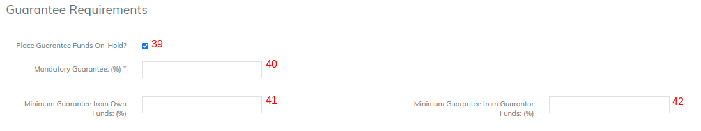

# Guarantee

#### Guarantee Requirements 

On checking the check box will enable "Place Guarantee Funds On-Hold".&#x20;

1. Mandatory Guarantee (%): This is to provide total % of loan amount as mandatory guarantee. Example: 20 %.&#x20;
2. Minimum Guarantee from Own Funds (%):\
   Example: 10 % of loan amount from Own funds.&#x20;
3. Minimum Guarantee from Guarantor Funds (%): Example: 10 % of loan amount from Guarantor Funds.
