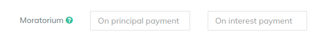

# Moratorium

Moratorium period refers to the period of time during which you do not have to pay an EMI or Principal / Interest on the loan taken.&#x20;

Suppose, If Moratorium

On Principle Payment is '6' and the client's Repayment Frequency is every month, then for the first six months, the client has to pay Interest only and after six months the client starts paying principal amount too.

On Interest Payment is '6' and the client's Repayment Frequency is every month, then for the first six months, the client has to pay Principal only and after six months the client starts paying Interest amount too.

**Provide Moratorium (Optional)**&#x20;


For creating Bullet Loans, you can use Moratorium on principal payments by mentioning value equal to (Number of Repayments - 1)

