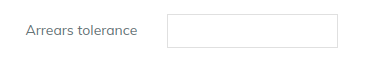
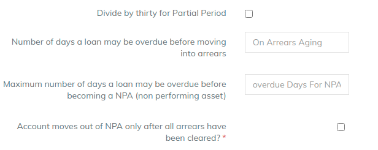

# NPA management

In order to ensure continued growth, it is critical that the banks and financial institutions are robust in managing the stress, particularly caused by Non-performing assets (NPAs) or bad loans.&#x20;

A. **Arrears Tolerance**

A loan is in arrears once the overdue amount entered into this field is exceeded. If this field is blank, the loan will be in arrears the day after a scheduled payment is missed.

Example - If 1000 is specified,  the loan will be in arrears once the overdue amount is greater then 1000&#x20;

B. **Number of days a loan may be overdue before moving into arrears**

A loan is labelled as _overdue_ after it crosses the days entered in this field. If this field is blank, Loan will never ve classified as overdue loan.&#x20;

Example - If 10 is specified, the loan will be overdue on the 11th day after a scheduled payment is missed.

C. **Maximum number of days a loan may be overdue before becoming a NPA (non performing asset)**

A loan is labelled as NPA after it crosses the days entered in this field. If this field is blank, Loan will never ve classified as NPA.&#x20;

Example - If 90 is specified, the loan will be called as NPA on the 91st day after a scheduled payment is missed.

D. **Account moves out of NPA only after all arrears have been cleared?**&#x20;

If enabled , then NPA classification will only be removed if the overdue amount (arrears) become zero.

E . **Divide by 30 for partial period**

Enable this configuration in order to use days in month as 30 for all the provisioning entries. &#x20;

