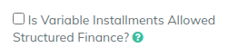

# Structured Finance

If you want to use custom schedules like step-up, step-down, then your can use the Structured Finance module

Enable it in the product so that you can edit the schedule after loan is created.&#x20;

