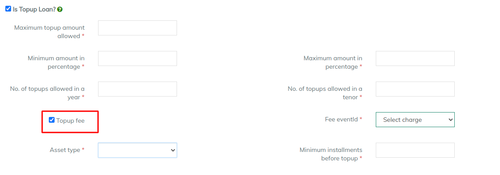

# Top Up Loan

### Top-Up loan

**Top**-**up loan** is a facility provided by banks, housing finance companies and other financial institutions that allows you to borrow a certain amount of money over and above your home **loan**.

\>>LMS also has an option of top up loan which has to be set while creating the product as we can see it in the below image

.png>)

Once the option is enable that is ticked it will ask for multiple details which are, maximum top up amount allowed, maximum amount in percentage and so many fields which has to be filled in terms of top up loan. Those fields are shown in below image

\>> Clicking on the checkbox Top up fees will open an option that is fee eventId it has charges created for the top up loan&#x20;

Maximum Top up amount Allowed - Maximum top up amount to be disbursed to a client

Minimum amount in Percentage - The highest amount to be disbursed to client in percentage

Maximum amount in Percentage - The highest amount to be disbursed to client in percentage

No. of top ups allowed in a year - NO of disbursements / Top ups to be given to customer within a year

No. of top ups allowed in a Tenor - No of Top ups given to customer within a tenor

Minimum installments before topup - No of installment paid before customer or client can have top up on existing loan&#x20;

Asset type&#x20;

1. Substandard assets: Assets which has remained NPA for a period less than or equal to 12 months. ...
2. &#x20;Doubtful assets: An asset would be classified as doubtful if it has remained in the substandard category for a period of 12 months.
3. _Loss assets:_ As per RBI, “Loss asset is considered uncollectible and of such little value that its continuance as a bankable asset is not warranted, although there may be some salvage or recovery value.”

&#x20;

