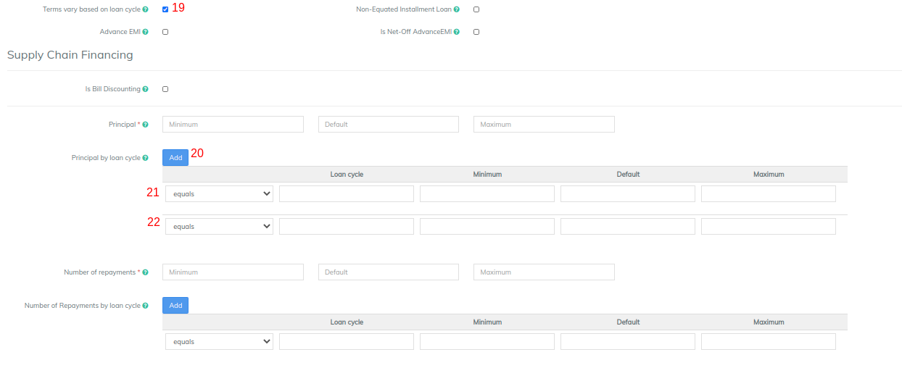

# Terms

Terms section will help you configure the hygience parameters of your loan product.&#x20;

## **Normal Loan**

Normal loan will have below parameters

A. Provide **Principal** (Loan) amount, Default field is a mandatory field. Minimum and Maximum are optional fields wherein the loan amount cannot be provided beyond the min & max value.Example: Minimum: 5000, Default: 10000 & Maximum: 15000. At the loan account level default values will be shown.

B. Provide **Number of repayments**, Default field is a mandatory field. Minimum and Maximum are optional fields wherein the number of repayments cannot be provided beyond the min & max value.Example: Minimum: 5, Default: 10 & Maximum: 15. At the loan account level default values will be shown.

C. Provide **Rate of Interest**, Default field is a mandatory field. Minimum and Maximum are optional fields wherein the rate of interest cannot be provided beyond the min & max value.Example: Minimum: 18, Default: 22 & Maximum: 24. At the loan account level default values will be shown.

D. Provide **Repaid Every** value

1. Select **Day** or **Week** or **Month**
2. Enter the multiple value

Examples for frequencies of schedules

1. For Daily: Enter 1 and select Day
2. For Weekly: Enter 1 and select Week
3. For Monthly: Enter 1 and select Month
4. For quartely: Enter 3 and select Month
5. For half yearly: Enter 6 and select Month
6. For bi-weekly: Enter 2 and select Week

E. Minimum days in disbursal dates and first repayment date

This is an optional field. This could be used in case you want to set "Minimum days between disbursal and first repayment date". Example: 10 (Days), So if the loan disbursement is on January 1st and normal expected first repayment is on 8th January, If you are providing 10 days as minimum days between disbursal and first repayment date, the first repayment will happen on 11th Jan.&#x20;

F. Other checkboxes (This is required for advanced configurations)

1. [Terms vary based on loan cycle](./#product-based-on-loan-cycle)
2. [Non-equated Loans](./#product-with-non-equated-installment)

| **Terms Section**                                                                    |                                                                                                                                                                                                                                                                                                                                                                                                                                                                                                                                                                                                                                                                                                                                                                                                                                                                                                                                |                                                                                    |                                                           |
| ------------------------------------------------------------------------------------ | ------------------------------------------------------------------------------------------------------------------------------------------------------------------------------------------------------------------------------------------------------------------------------------------------------------------------------------------------------------------------------------------------------------------------------------------------------------------------------------------------------------------------------------------------------------------------------------------------------------------------------------------------------------------------------------------------------------------------------------------------------------------------------------------------------------------------------------------------------------------------------------------------------------------------------ | ---------------------------------------------------------------------------------- | --------------------------------------------------------- |
|                                                                                      |                                                                                                                                                                                                                                                                                                                                                                                                                                                                                                                                                                                                                                                                                                                                                                                                                                                                                                                                |                                                                                    |                                                           |
| Terms vary based on Loan Cycle                                                       | 
A loan cycle tracks the number of times a borrower has taken a particular loan.

Leave this checkbox unchecked if the terms do not vary based on the Loan Cycle.

Check this checkbox if terms vary based on the Loan Cycle. See <em>additional fields</em> for additional information required for this type of loan product.
                                                                                                                                                                                                                                                                                                                                                                                                                                                                                                                                                                                |                                                                                    |                                                           |
| 
Principal:

Minimum

Default

Maximum
                          | 
These fields are used to define the minimum, default and maximum principal allowed for the loan product.

When a client applies for a loan account, the loan account application will be populated with the default principal amount. The lending officer may modify the default within the minimum to maximum range.

Using the example values (see column to the right), a new loan account application for this loan product would default to a principal amount of 100 (in the selected currency). The lending officer may modify the principal as low as 25 and as high as 250.
                                                                                                                                                                                                                                                                                                                          | 
Minimum: 25

Default: 100

Maximum: 250
                           | 
Required fields

Numeric whole numbers
        |
| 
Number of repayments:

Minimum

Default

Maximum
               | 
These fields are used to define the minimum, default and maximum number of repayments allowed for the loan product.

When a client applies for a loan account, the loan account application will be populated with the default number of repayments. The lending officer may modify the default within the minimum to maximum range.

Using the example values (see column to the right), a new loan account application for this loan product would default to 12 repayments. The lending officer may modify the number of repayments as low as 6 and as high as 60.
                                                                                                                                                                                                                                                                                                                                         | 
Minimum: 6

Default: 12

Maximum: 60
                              | 
Required fields

Numeric whole numbers
        |
| 
Nominal interest rate:

Minimum

Default

Maximum

Period
 | 
These fields are used to define the minimum, default, maximum period for the nominal interest rate allowed for the loan product. The minimum, default, and maximum nominal interest rates are expressed as percentages. The period value is selected from the choices in the list (Per Month, Per Year). The period value is not modifiable on individual loan accounts.

When a client applies for a loan account, the loan account application will be populated with the nominal interest rate. The lending officer may modify the default within the minimum to maximum range.

Using the example values (see column to the right), a new loan account application for this loan product would default to a nominal interest rate of 1.5. The lending officer may modify the nominal interest rate as low as 1.25 and as high as 2.0. In this example, the nominal interest rate will be applied monthly.
 | 
Minimum: 1.25

Default: 1.5

Maximum: 2.0

Period: Per Month
 | 
Required fields

Numeric with decimals
        |
| Repaid every                                                                         | 
These fields are input to calculate the repayment schedule for a loan account and are used to determine when payments are due. Enter a number into the first field and then select the frequency from the list (Days, Weeks, Months).

Using the example values (see column to the right), a new loan account application for this product would be initially set for repayments every 2 weeks. The lending officer may change the payment timing during the loan application process.
                                                                                                                                                                                                                                                                                                                                                                                                                             | 2 Weeks                                                                            | 
Required fields

Numeric and select from list
 |

## Product based on  Loan Cycle&#x20;

1. Check the check box to enable "**Terms vary based on loan cycle**".&#x20;
2. Provide values in principal section. Click on Add button to define Principal by loan cycle. In the image above:
3. Equals - Loan cycle as 1 with Principal Default amount of 10000. (Had there been one more cycle, it could be defined as Equals - loan cycle as 2 with principal amount)
4. Greater than - Loan cycle as 1 with Principal Default amount of 20000. Greater than should always be used for the last cycle.
5. Define Number of repayments by loan cycles in the same way.&#x20;

## Product with Non-Equated Installment

Non equated loans can have different principal and interest frequency. Example of non-equated loans loan can be principal being repaid quaterly but interest in repaid monthly.&#x20;

As this loan has seperate frequency for principal and interest you need to input below fields seperately for principal and interest

A. **Number of Repayments:** Enter the no. of repayments for principal and interest

B. **Repaid Every** fields: Enter the frequency of principal and interest


The multiplication of the **Number of Repayment** and **Repaid Every** should be equal for principal and interest.&#x20;

Example -&#x20;

For Principal - Repaid every is 2 every month and no. of repayment is 12.&#x20;

For Interest - Repaid every is 1 every month and no. of repayment is 24


C. **Minumum Days between Disbursal and First repayment:** This field is non-mandatory, but is required can be entered for principal and interest separately.&#x20;

