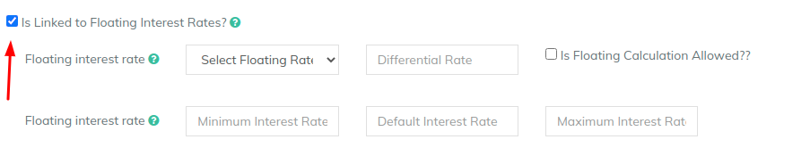

# Floating Interest Rates

You need to have [floating interest rate schemes](../../floating-rates.md#creating-floating-rate) pre-configured in order to use it in the product. Follow the link to configure them as pre-requisite


[floating-rates.md](../../floating-rates.md)


A. In the product page you need to enable the floating interest rate checkbox

B. Select the **Floating Interest rate** Scheme from the dropdown

C. **Interest rate differential -** Provide differencial interest rate here that you want to charge specific to this product over and above the floating interest scheme

D. **Is Floating Calculation Allowed**?: Enable this flag

E. **Floating Interest Rate**: Input the default / Minimum / Maximum for the differencial rate at loan level&#x20;


LMS has three level of differencial rates for Floating Interest Schemes

1. At Scheme Level : Create Scheme with Base rate plus differencial
2. At Product Level : Scheme plus product level differential
3. At Loan Level : Product level rate plus loan level differencial

Example-&#x20;

A loan is created with base rate of 8%, scheme differencial of 1%, product level differencial withof 0.5%, loan level of 1%, then the effective interest rate for the loan will be = 8 + 1 + 0.5 + 1 = 10.5%


&#x20;
