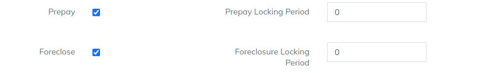

# Lockin Period

You can set the locking period for foreclosure and advance payment of the loan


Foreclosure: Is an activity of closing the loan completely before the due date.



Part Payment: Is an activity of paying extra amount than what is due to your loan account. It is also called as 'Advance Payment' / Partial payment / Excess Payment


Lockin period works in the frequency selected for the loan.&#x20;

Example -&#x20;

1. If the loan frequency is "**Month",** then the locking period 6 will mean that the loan has locking for 6 months
2. If the loan frequency is "**Week",** then the locking period 6 will mean that the loan has locking for 6 weeks

