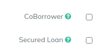
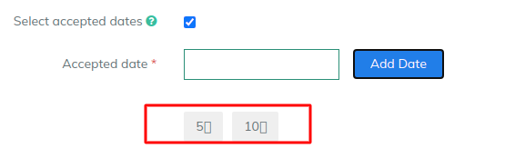

# Others

Other fields which can be used as additional configurations

A. **Secured Loan:** If enabled, this makes collateral linkage to the loan as one of the steps in loan creation

B. **Co-borrower:** If enabled, Co-borrower can be added to the loan. You can have multiple co-borrowers

C. **Age Criteria:** This validation can be applied to the product so that client within the age range can only avail the loan

D. **Select Repayment Dates:** You can put validation on the due date of the loans. You can select the dates at product level.Only those dates will be allowed for scheduling your installment due date


If you want to allow all the dates, keep this flag disabled


