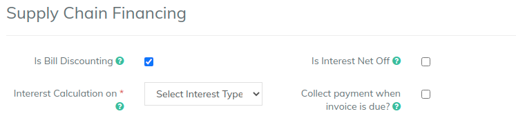

# Supply Chain Financing

Supply chain financing happens when there are invoices / bills / contracts are present.&#x20;

You can configure the product to work for supply chain in the below way

A. **Is Interest Net-off:** All the interest in the schedule can be net-off (deducted from disbursement amount) if this flag is enabled.&#x20;

B. **Interest Calculation On:** Interest can be calculated on two parameters

* LTV: This method derives interest amount from the LTV of the loan.&#x20;


Example - Loan with amount equal to 100000, and LTV (Loan to value) of 90% will autocalculate the interest amount as 10% of the loan, equal to 10000. &#x20;


* Interest Rate: This is normal interest rate calculation method used for normal term loans&#x20;

C. **Collect Payment Invoice is due:** Enabling this flag will give you a additional screen to capture the invoice details at the time of loan creation. You can then knock-off the invoice once you get the payment of the invoice.&#x20;

