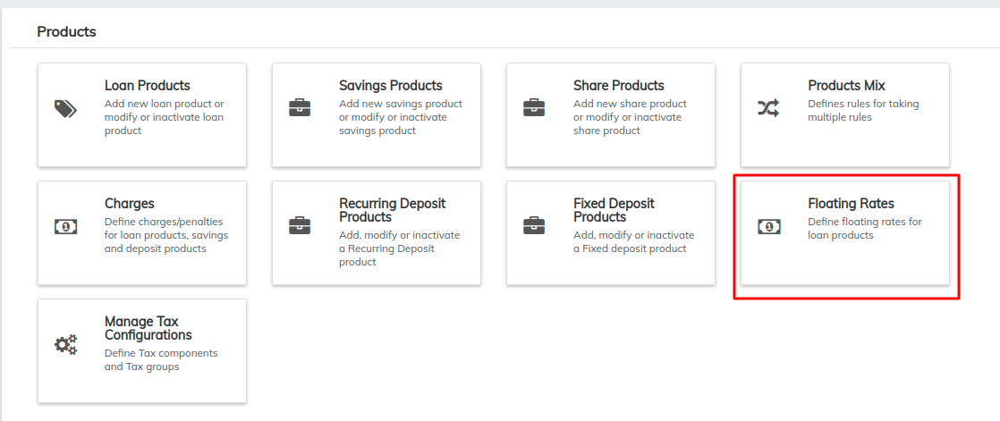

# Floating Rates

Floating Interest Rates adds the ability to define a base lending rate and interest rate differentials to raise or lower the rate. These differentials can be in time-based interest rate bands.

Beginning at the main screen, select **Admin >> Products** from the drop-down menu. This will launch the **Products** menu.

Select **Floating Rate**.

This will launch the **floating Rate** page

## **Creating Floating Rate**

Click on **+Create Floating Rate.**&#x20;

**1 - Floating rate Name:** Provide name of the floating rate, for example - Base lending rate.&#x20;

**2 - Is base lending rate:** Check the check box if this is a base lending rate. Note for an organization it could have only one base lending rate irrespective of many interest rate and dates.&#x20;

**3 - Active:** Check the check box, if you want to activate this rate.&#x20;

**4 - Add:** Click on Add button, in order to add and define new From date, Interest rate and Is differential.&#x20;

**5 - From Date:** Provide start date from when you want to activate this rate. Note, date can't be on current date nor back date, it should be future date. Unless there is a next from date it will consider the date for ever.

**6 - Interest rate:** Provide rate of interest value.&#x20;

**7 - Is Differential:** Check the check box, if you want to give is a differential rate of interest. Note this can't be enabled on the same, if it is a "Is base lending rate is enabled". The differential rate provided here is on the Base lending rate chart.


For Example:- In "Is base lending rate chart" provided interest rate is 10% from date - 2nd July to 2nd August&#x20;

And in another chart you need to create a differential floating rate chart and provide the interest rate, example -1%,&#x20;

So It will be 10% (Base lending rate chart) + 1% (Differential rate chart) = 11% total. Please refer screen shots below - 2 & 3 for clarity.&#x20;



So provided rate for this will be added on to the is base lending defined rates. Base lending rate chart should have been defined to create this chart.


**8 - Actions:** Click on the x button, if you want to remove the row.&#x20;

**9 - Submit:** Click on Submit button.&#x20;

## **Viewing Floating Rate**

To view defined rate chart, Go to Admin>>Products>>Floating Rates

**Screen shot - 1:** showing list of created Floating rate charts &#x20;

**Screen shot - 2:** showing an example of Base lending rate chart. As you can see only "Is base lending rate" box is checked.&#x20;

**Screen shot - 3:** Showing an example of Differential rate chart. As you can see only "Is Differential" box is checked.

So provided rate for this will be added on to the "is base lending defined rates". &#x20;

**Screen shot - 4:** Showing an example of Absolute rate chart. As you can see only "Is Differential" and "Is differential" are not enabled (Unchecked).&#x20;

## **Editing Floating Rate**

To Edit defined rate chart, Go to Admin>>Products>>Floating Rates>>Select required chart for editing>> Click on Edit button>> Then make necessary changes and click on Submit.&#x20;

