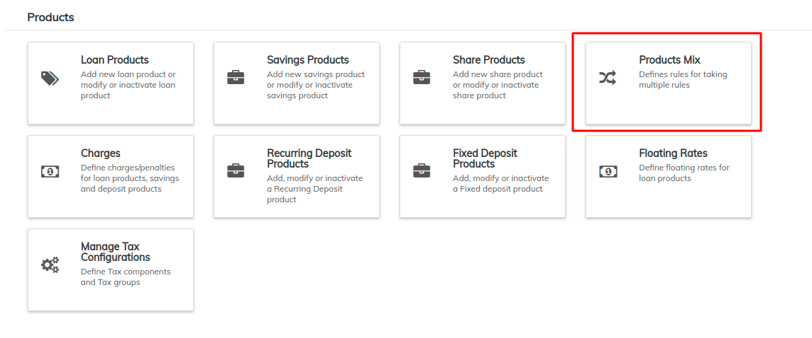
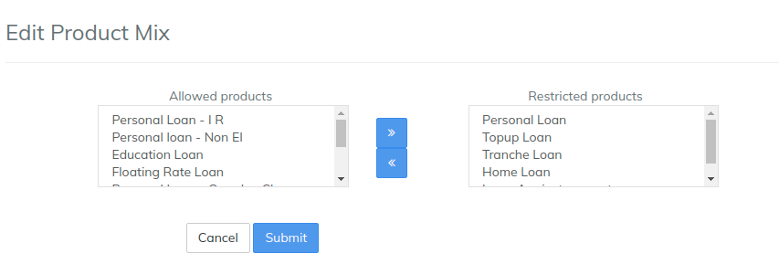

# Product Mix

The **Product Mix** function allows a financial institution to define rules that restrict the loan accounts that may be held by a client at once. LMS checks a client's active loan accounts when a new loan is being disbursed. If there is a conflict between the client's active loan accounts and the loan account to be disbursed, it will result in an error and the new loan account will not be disbursed.&#x20;

By default, the system does not restrict any product combinations.

From the Dashboard, select **Admin**, then **Products** from the drop-down menu.

This will launch the **Products** menu.\
Select **Product Mix.**&#x20;

## **Creating a new Product Mix**

1. Navigate to **Admin** >> **Products** and click on '**Product Mix**' to see the following window:

.png>)

1. Click on '**+Add**'  button, and the following window will be displayed:\

2. Select the loan product from the drop-down menu (_for instance: Agriculture_). After choosing the loan product, you can decide which loan products a client can get (_Allowed Products_) and which loan products are prohibited for the client (_Restricted Products_). \

* Move loan products from the **Allowed Products** list to the **Restricted Products** list by clicking on the product name and clicking on **>>**.
* Move loan products from the **Restricted Products** list to the **Allowed Products** list by clicking on the product name and clicking on **<<**.

1. Once you're done, click on the '**Submit**' button  to create a product mix.&#x20;


For example: if you have three different loan products (A, B, and C), you can make a rule that if a client has taken loan A, then the client can have loan B but not C.&#x20;


## **Edit or Delete Product Mix**

1. To edit or delete a Product Mix, navigate to **Admin** >> **Products** >> **Product Mix.** The following window will be displayed: \
   \
   \
   \

2. Click on the loan product on which the Product Mix is defined (_in this example, 'Agricultural Loan'_) to view the Product Mix:\
   \
   \
   \

3. Either click on '**Edit**' or the '**Delete**' button to modify or delete the product mix respectively.
