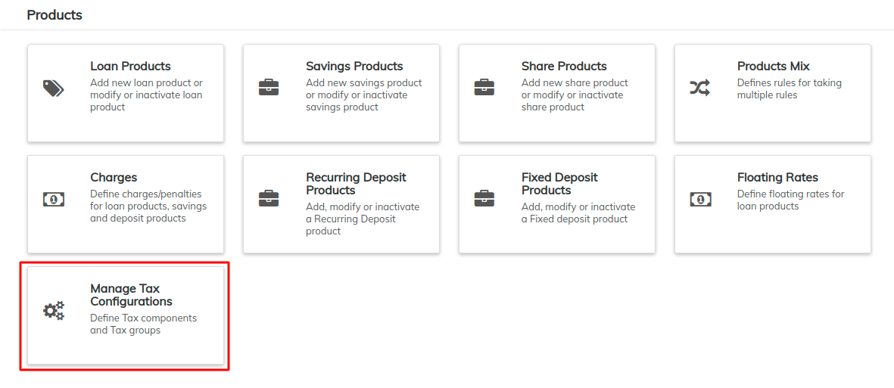
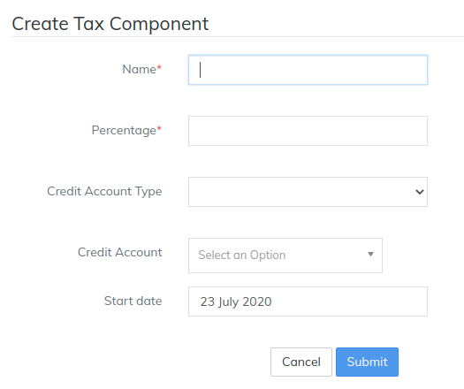
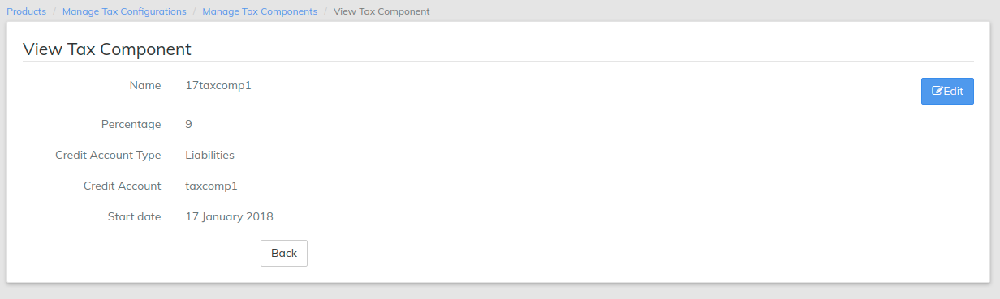
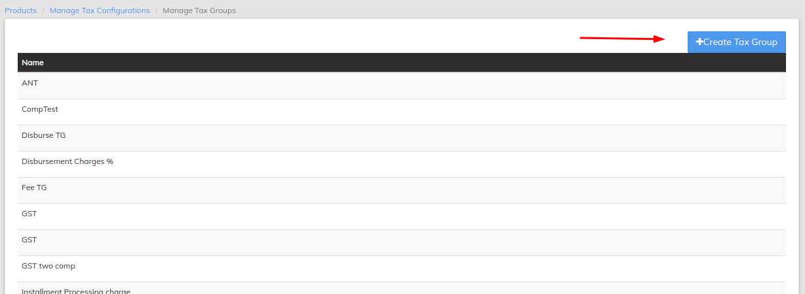
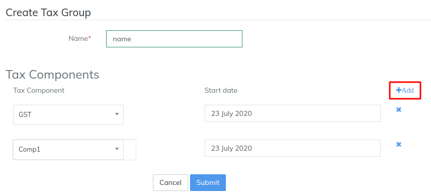

# Taxation

Beginning at the main screen, select **Admin**, then **Products** from the drop-down menu. This will launch the **Products** menu.

Select **Manage Tax configuration.**&#x20;

**View Manage Tax configuration**&#x20;

## Create Tax Components&#x20;

Click on  button&#x20;

1 - Provide **Name** - Is the tax name.&#x20;

2 - Provide **percentage** - Is the tax percentage name.&#x20;

3 - Select **Credit account type** - Is the account type to be selected, if you are enabling accounting module then you need to select this field.&#x20;

4 - **Credit Account** - Is the account name to be selected, you should have defined account in the [Chart of Accounts - General Ledger Setup](../accounting/chart-of-accounts.md).&#x20;

5 - **Start Date** - Provide start date.&#x20;

6 - Click on **Submit** button. &#x20;

### View / Edit tax components &#x20;

Products>>Manage tax configuration>>Manage tax components&#x20;

## Create Tax Group&#x20;

Click on +Create tax group&#x20;

1. Provide **Name** - Is the tax group name to be provided
2. Click on **Add** button - Clicking on Add button will add tax component field for selection. In example 3 & 4 shown above are new tax components added.&#x20;
3. Select **Tax component** & provide **date**. In the example shown above create tax component - WithholdTAX is being shown for selection.
4. Select T**ax component** & provide **date**. In the example shown above create tax component - ISLR tax is being shown for selection.
5. Click on **Submit** button.&#x20;

## Applying tax&#x20;


Only Tax group can be applied not the tax component. You could apply tax group for charges and penalties.&#x20;


Tax group can be applied to [Charges and Penalties](charges.md) while you are creating them.&#x20;

