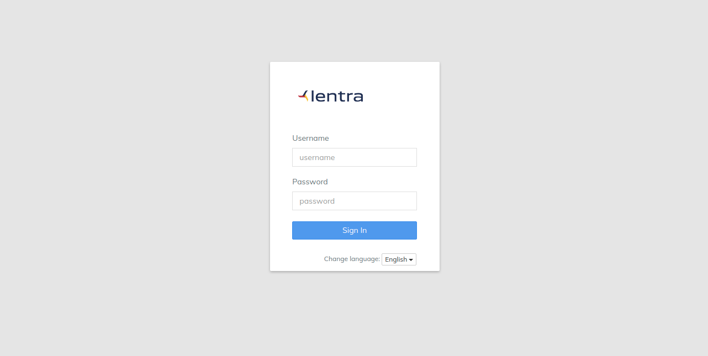
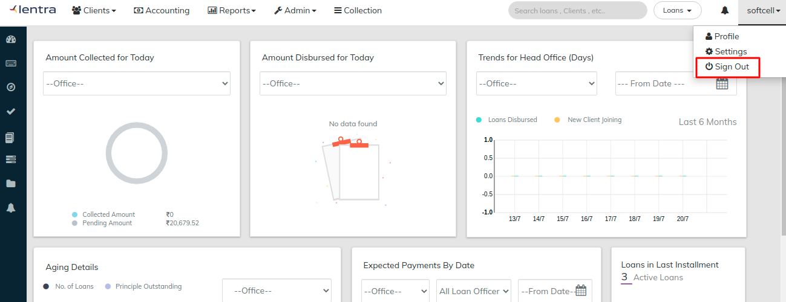
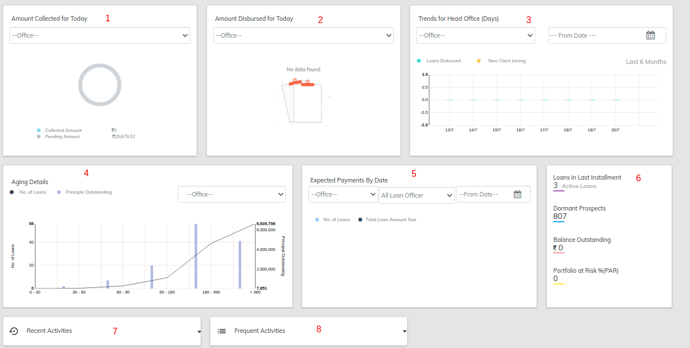
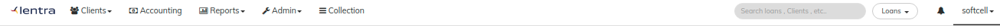

# Navigation

## Sign- in

1. Open a new window in any internet browser (e.g., Firefox, Chrome, Internet Explorer)
2. Enter the URL in the address bar, LMS sign-in page will be displayed, as shown in the picture above.
3. Enter your username in the username field (Default user name - {**yourUsername}**)
4. Enter your password in the password field (Default password - **password**)&#x20;
5. Click **Sign In** to login as super user for the first time. \
   Once you sign in, the[ Dashboard](navigation.md#dashboard) is displayed.

## Signout

From any page in the application:

1. Click on the button labelled **your usename,** which is on the top-right corner of the page.
2. Click on the **Sign Out** option.\
   You will be logged out of the system and the Sign In page will be displayed.

## Dashboard

Clicking on the left top corner logo, will redirect you to the dashboard.&#x20;

Dashboard gives you access to below reports with dynamic filters

| No. | Report Name                          | Filters                            |
| --- | ------------------------------------ | ---------------------------------- |
| 1   | Amount to be collected today         | Office                             |
| 2   | Amount Disbursed Today               | Office                             |
| 3   | Trends of Disbursement / New clients | Office / From Date / Last 6 months |
| 4   | Aging Details                        | Office                             |
| 5   | Expected Repayemnt by date           | Ofice / Loan officer / From date   |
| 6   | Quick Reports                        | -                                  |
| 7   | Recent Activites                     | -                                  |
| 8   | Frequent Activities                  | -                                  |



## Top navigation menu

* Tenent Logo
* [Clients](../admin/client-management/) Menu
* [Accounting](../admin/accounting/)
* [Reports](reports/) Menu
* [Admin](../admin/administration/) Menu
* [Collections](broken-reference)
* [Global Search bar](navigation.md#global-search)
* Notifications
* [Profile](navigation.md#profile)

## Left navigation menu (Side Bar)

* Dashboard
* Keyboard Shortcuts
* Navigation
* Checker inbox and tasks
* Collection Sheet
* Individual Collection Sheet
* Closing Entries
* Notifications

## Global search

.png>)

You can search any loan / client / groups using&#x20;

* ID generated by LMS
* Name of the client / group
* External ID linked to the client / loan / group

**Default** the option selected will be "Loans"

## Keyboard shortcuts

Keyboard shortcuts can boost your productivity if your daily job involves using LMS on a frequent basis. Not only do they get the work done quickly, but also improve efficiency. Give them a try and you might just find yourself getting addicted to using these shortcuts.

| Navigation Page               | ctrl + shift + n |
| ----------------------------- | ---------------- |
| Checker Inbox & Pending Tasks | ctrl + shift + i |
| Collection Sheet              | ctrl + shift + o |
| Create Client                 | ctrl + shift + c |
| Create Group                  | ctrl + shift + g |
| Create Center                 | ctrl + shift + q |
| Frequent Posting              | ctrl + shift + f |
| Closure Entries               | ctrl + shift + e |
| Journal Entry                 | ctrl + shift + j |
| Reports                       | ctrl + shift + r |
| Accounting                    | ctrl + shift + a |
| Save/Submit Forms             | ctrl + s         |
| Run Report                    | ctrl + r         |
| Cancel                        | ctrl + shift + x |
| Logout                        | ctrl + shift + l |
| Search                        | alt + x          |
| Help                          | ctrl + shift + h |
| Pagination: Next              | ctrl + n         |
| Pagination: Previous          | ctrl + p         |

## Profile

## Help

