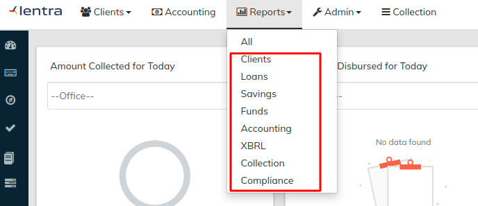

# Reports

Reports can be accessed by using the [top navigation bar](../navigation.md#top-navigation-menu). There are 6 types of reports available out of the box

* Client
* Loan
* Funds
* Accounting
* Collection
* Compliance

## Generate a Table report

Step1: Click on the report with type Table.&#x20;

Step2: Select the appropriate filters on the right of the screen.&#x20;


If you get error or missing mandatory fields, then please reload the screen again to fill the report filters


Step3: Click on **Run Reports**

## Generate Pentaho report

Step1: Click on the report with type **"Pentaho"**.


Learn more about [Pentaho](https://en.wikipedia.org/wiki/Pentaho) Reports.


Step2: Select the appropriate filters on the right of the screen.&#x20;


If you get error or missing mandatory fields, then please reload the screen again to fill the report filters


Step3: Click on **Run Reports**

### Output Formats

You can pull the reports in below out formats

| Type    | Formats                                 |
| ------- | --------------------------------------- |
| Table   | Normal / CSV                            |
| Pentaho | Normal / Excel / Excel 2007 / CSV / PDF |

### List of System Reports


[system-reports.md](system-reports.md)


## Using report via APIs

All the Reports can be pulled via using our advanced API framework. The APIs support for both table and pentaho reports.&#x20;

