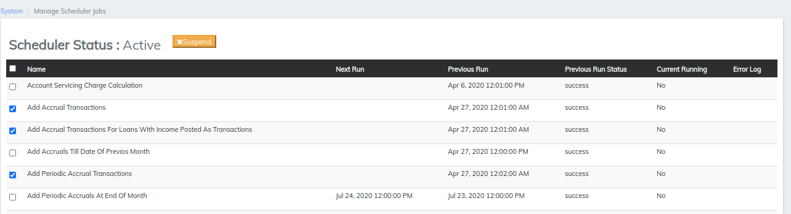
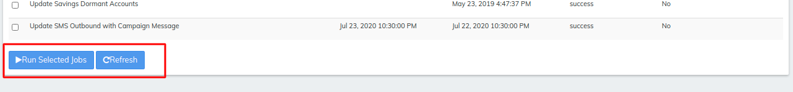
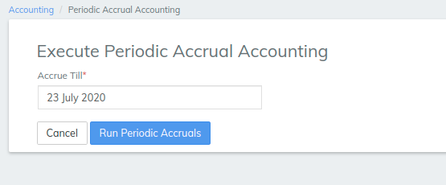
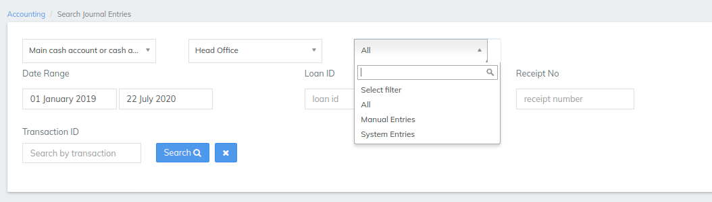
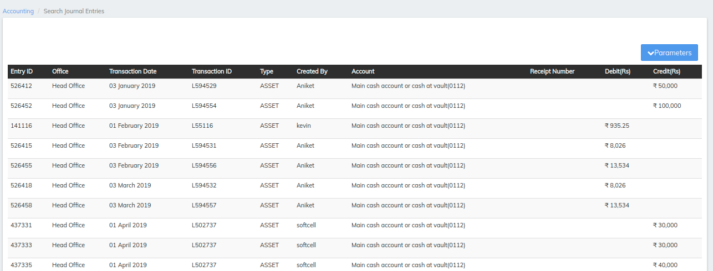

# Accruals

## Accruals

There are two types of **Accrual Accounting:**

1\) **Accrual (Upfront):** If you enable this option and add entries while defining the loan product (_as shown in the table below_), Accrual entries are passed at the time of disbursal of the loan (_to the Client or Group_).&#x20;

2\) **Accrual (Periodic)**: If you enable this option and add entries while defining the loan product, Accrual can be done with a specified periodicity or can be done manually. To specify the Periodicity of Accrual, follow these steps:

&#x20;Go to **Admin** >> **System** >> **Scheduler Jobs** to see the following window (_with a list of Jobs_):

* Check the check boxes beside '**Add Accrual Transactions**' and '**Add Periodic Accrual Transactions**' _(shown in the screenshot_ _above)._\
  \

* At the bottom of the page, click on the '**Run Selected Jobs**' button, followed by the '**Refresh**' button.&#x20;

Once the [Loan Product](../../admin/products-1/create-loan-product/) is defined with Accrual Accounting (_periodic_), (_Click Here to see_ [_Accounting_](broken-reference) _Fields for Loan Product_)

* Create a Loan Account for a Client/Group with the Loan Product having Accrual Accounting. (_Click Here to see how to_ [_Loan Screen Overview_](../loan-transactions/loan-screen-overview.md))
* Make a few transactions (_for instance: Repayments_).
* Then go to the **Accounting** >> **Accruals**. The following window will be displayed:

* Specify the date in the "**Accrue Till**" field.
* Finally, execute Periodic Accrual Accounting till specified date by clicking on the blue "**Run Periodic Accruals**" button in order to affect all the accrual accounts (f_or instance: Interest Receivable, Fees Receivable, etc._).

To see the entries in accrual accounts,

* Go to [**Accounting**](https://mifosforge.jira.com/wiki/spaces/docs/pages/101384453/Accounting) >> **Search Journal Entries**. The following window will be displayed:

As shown in the screenshot above, select the appropriate filters and duration and click on the '**Search**' button to see the accrual transactions that occurred during the specified duration.

