# Advanced Accounting Rules

## Advanced Accounting Rules 

The Advanced Accounting Rule is a powerful feature that allows you to post to multiple general ledger accounts for a single product. Examples include mapping to multiple fund sources based on payment type, or mapping fees or penalties to specific income accounts.

Creating an Advanced Accounting Rule requires two steps:

Step 1: Configure Payment Types, Fees, and Penalties.

Step 2: Map Payment Type to fund sources and map Fees and Penalties to income sources.

#### Creating an Advanced Accounting Rule 

You can create the following Advanced Accounting Rules for Loan Products:

**Advanced Accounting Rules based on** **Payment Type** to automatically debit accounts based on payment type—for example, m-pesa payments are automatically debited from the m-pesa account and check payments are automatically debited from a different account.

**Advanced Accounting Rules based on Fees** to automatically credit a specified Income Account based on the Fee—for example, processing fees are automatically credited to the Fees and Charges account.

**Advanced Accounting Rules based on Penalties** to automatically credit a specified Income Account based on the Penalty—for example, late fees are automatically credited to the Penalties account.

**Step 1: Configure Payment Type, Fees, and Penalties**

**To configure Advanced Accounting Rules based on Payment Type:**

To create an Advanced Accounting Rule based on Payment Type, you configure the Payment Types drop-down list in the Manage Codes section of Admin System tools. In the following example, m-pesa payments are automatically debited from the m-pesa account.

To configure an Advanced Accounting Rule based on Payment Type, do the following:

1. On the LMS toolbar, click **Admin,** and **** then click **System** to open the System menu.

2\. On the System menu, click **Manage Codes** to open the **Manage Codes** dialog.

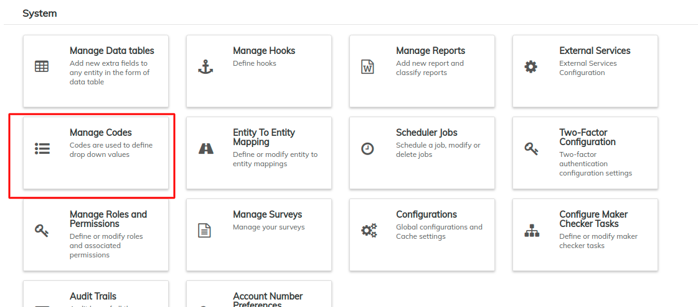

3\. In **Code Name** list, select **Payment Type**.

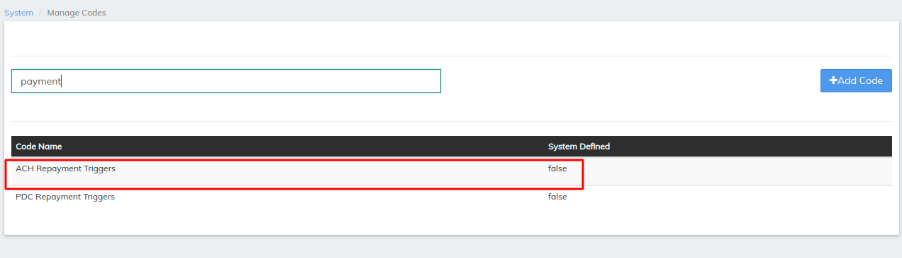

4\. In the **Payment Type** dialog, click **+Add Code Values**.

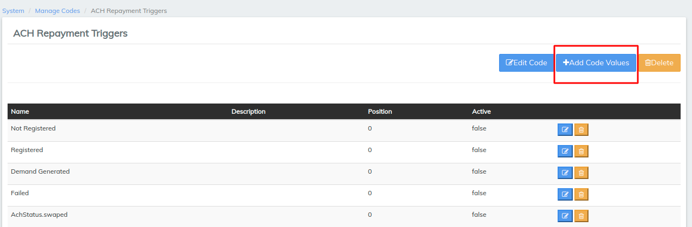

5\. In the **Code value** text box, enter a name for your payment type and then click **+Add**.

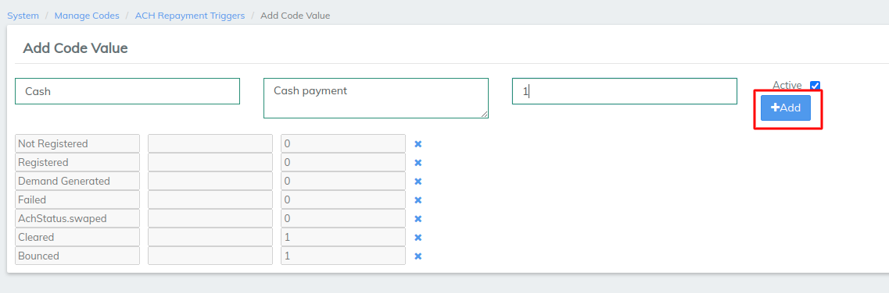

**NOTE:** To edit the code value, click the **Edit Code Value** button. To delete the code value, click the **Delete Code Value** button.

**To configure Advanced Accounting Rules based on Fees:**

To create an Advanced Accounting Rule based on Fees, you define a loan charge in the Charges section of the Admin Products tools. In the following example, processing fees are automatically credited to the Fees and Charges account.

To map Fees to specific Income Accounts, do the following:

1. On the LMS toolbar, click **Admin,** and **** then click **Products** to open the Products menu.

2\. On the Products menu, click **Charges**.

3\. In the **Charges** dialog, click the **Create Charge** button. Refer [Charges](../../admin/products-1/charges.md) page for charge creation

**To configure Advanced Accounting Rules based on Penalties:**

To create an Advanced Accounting Rule based on Penalties, you define a loan penalty in the Charges section of the Admin Products tools. In the following example, late fees are automatically credited to the Penalties account.

&#x20;To map Penalties to specific Income Accounts, do the following:

On the LMS toolbar, click **Admin,** and **** then click **Products** to open the Products menu.&#x20;

.png>)

2\. On the Products menu, click **Charges**.

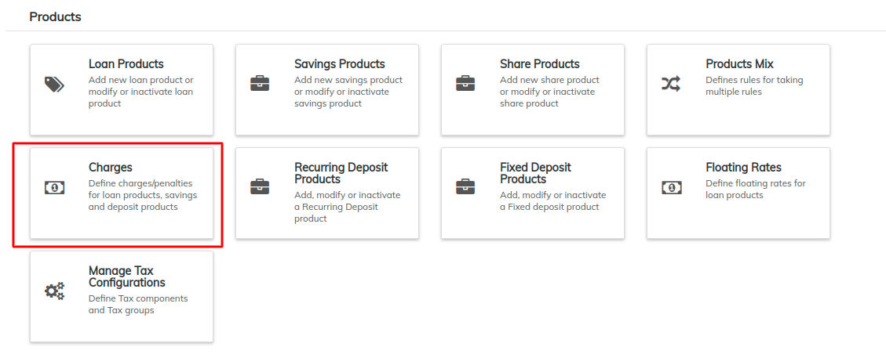

3\. In the **Charges** dialog, click the **Create Charge** button.

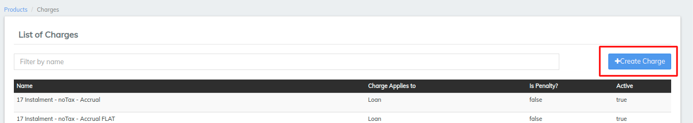

4\. In the **Charges applies to** drop-down list, select a product.

5\. In the **Create Charge** dialog, do the following:

1. In the **Name** textbox, enter a name for the penalty.
2. In the **Currency** drop-down list, select a currency.
3. In the **Charge time type** drop-down list, select a charge time type.
4. In the **Charge calculation** drop-down list, select a method for calculating the penalty.
5. In the **Charge payment by** drop-down list, select a method for payment.
6. Select the **Add Fee Frequency** check box.
7. In the **Charge Frequency** drop-down list, select the frequency (days, weeks, months, or years) to charge the penalty.
8. In the **Frequency** **Interval** textbox, type a number for the frequency interval.
9. In the **Amount** textbox, type the amount of the penalty.
10. Select the **Active** check box.
11. Select the **Is Penalty** check box, and then click the Submit button.

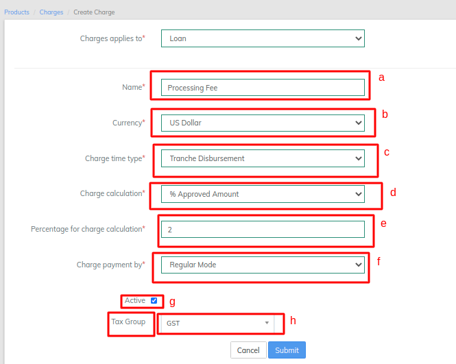

**Step 2: Map Payment Type to fund sources, and map Fees and Penalties to income sources.**

****

After you have configured your Payment Terms, Fees, and Penalties, you are ready to create your Advanced Accounting Rule.

To create an Advanced Accounting Rule based on Payment Type, Fees, or Penalties, do the following:

1. On the LMS toolbar, click **Admin,** and **** then click **Products** to open the Products menu.

**2.** On the Products menu, click **Loan Products**.

.png>)

3\. In **Loan Products** list, select the Loan Product to which you want to add an advanced accounting rule.

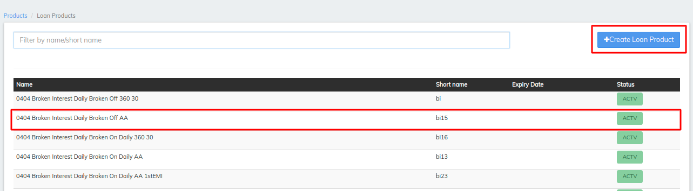

4\. Click **Edit**.

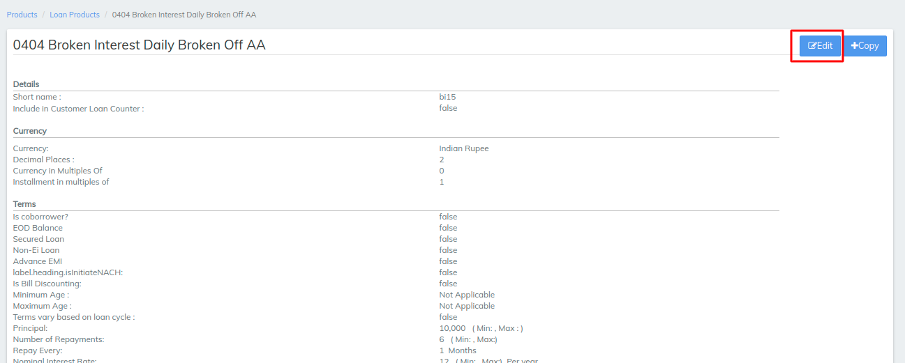

5 .Scroll to the bottom of the Loan Product dialog. Under **Accounting**, if **None** is selected, select one of the other options to expand the Accounting section.

.png>)

6\. At the bottom of the **Accounting** section, click **show** to expand **Advanced Accounting Rules**.

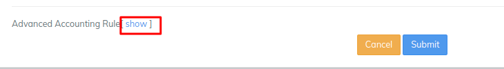

7\. Under the expanded **Advanced Accounting Rules**, you can add Payment Type, Fees, or Penalties Advanced Accounting Rules:\

a. To add a **Payment Type** Advanced Accounting Rule:\
Under **Configure Fund Sources for Payment Channels** click the **Add** button and then select a **Payment Type** and a **Fund Source** from the drop-down lists.\
**Tip:** To add Payment Types to the Payment Type drop-down list, see **Advanced Accounting Rules based on** **Payment Type** in **Creating an Advanced Account Rule** above.

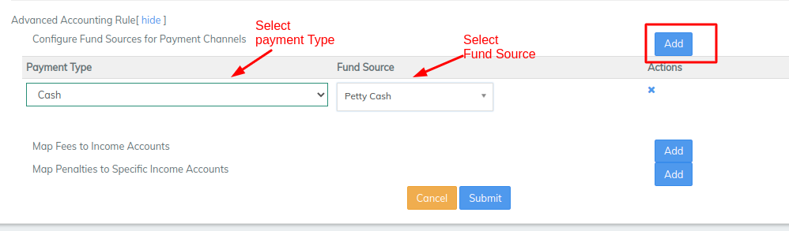

b. To add a **Fees** Advanced Accounting Rule:\
Under **Map Fees to Income Accounts**, click the **Add** button and then select a **Fee** and an **Income Account** from the drop-down lists.\
**Tip:** To add Fees to the Fee drop-down list, see **Advanced Accounting Rules based on** **Fees** in **Creating an Advanced Account Rule** above.

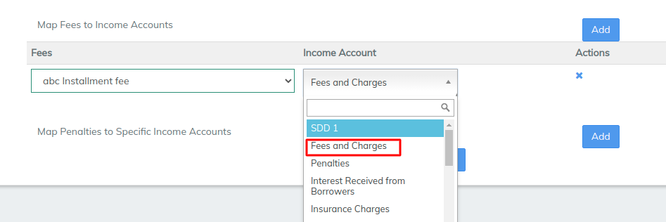

c. To add a **Penalties** Advanced Accounting Rule:\
Under **Map Penalties to Specific Income Accounts**, click the **Add** button and then select a **Penalty** and an **Income Account** from the drop-down lists.\
**Tip:** To add Penalties to the Fee drop-down list, see **Advanced Accounting Rules based on** **Penalties** in **Creating an Advanced Account Rule** above.

**Tip:** To add another Payment Type, Fees, or Penalties Advanced Accounting Rule, click the **Add** button. To delete a Payment Type, Fees, or Penalties Advanced Accounting Rule, click the **x** button.

8\. Click the **Submit** button.\
_Your Advanced Accounting Rule for your Loan Product appears under Accounting at the bottom of the dialog._&#x20;

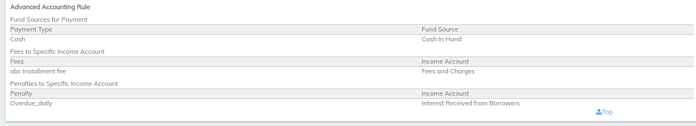

#### Applying an Advanced Accounting Rule 

Walk through normal transactions that reflect the advanced accounting rule being applied (that is. a transaction of a certain payment type being applied to a different general ledger account)&#x20;

