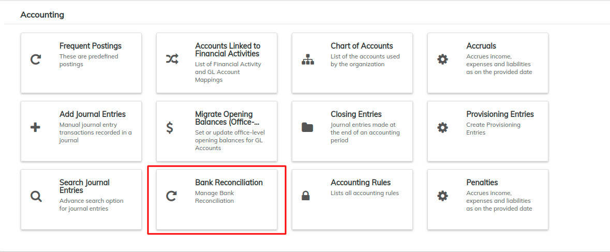
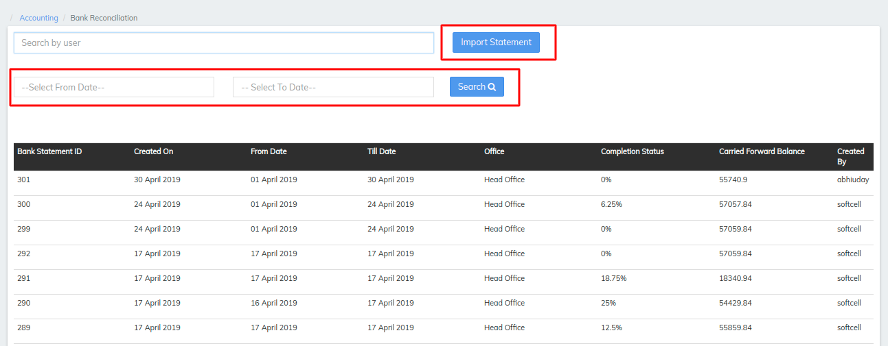
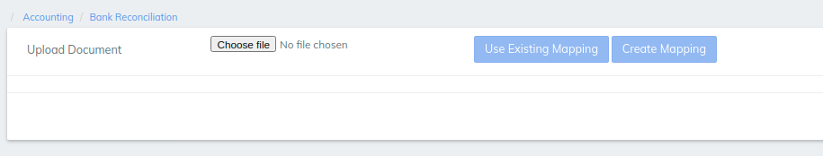

# Bank Reconciliation

## What Is a Bank Reconciliation Statement?

A bank reconciliation statement is a summary of banking and business activity that reconciles an entity’s bank account with its financial records. The statement outlines the deposits, withdrawals and other activities affecting a bank account for a specific period. A bank reconciliation statement is a useful financial internal control tool used to thwart fraud.

#### KEY TAKEAWAYS 

* A bank statement is a list of all transactions for a bank account over a set period, usually monthly.   &#x20;
* The statement includes deposits, charges, withdrawals, as well as the beginning and ending balance for the period.&#x20;
* Account-holders generally review their bank statements every month to help keep track of expenses and spending, as well as monitor for any fraudulent charges or mistakes.

### How a Bank Statement Works 

A bank issues a bank statement to an account holder that shows the detailed activity in the account. It allows the account holder to see all the transactions processed on their account. Banks usually send monthly statements to an account holder on a set date. In addition, transactions on a statement typically appear in chronological order.


LMS Provides an option to reconcile the statement and the transaction are done in the system which can be differ&#x20;


Go to **Accounting** >> **Bank Reconciliation** to see the following window

* By Clicking on Bank reconciliation it will open a window where it will ask you to Import a file to system&#x20;
* Also gives Start Date and End date to search&#x20;

* selecting Import Statement will lead to the screen Choose file

