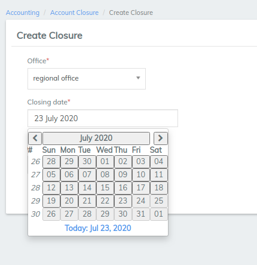

# Closing Entries

## Closing Entries 

In LMS, you can close accounting to journal entries. Closures can be applied to all branches or to each branch separately.

It is important for organizations to close accounting periodically to prevent transactions that affect the accounting books.

If you make a transaction before the closing date, you will receive an error. If you need to backdate a transaction to a date before the closure date, you must first delete the closure.

#### Create an accounting closure 

To close journal entries for an office, do the following:

1. On the LMS toolbar, click **Accounting** to open the Accounting menu.

.png>)

2\. On the Accounting menu, click **Closing Entries** to open the **Closed Accounting Details** dialog.

3\. In the **Closed Accounting Details** dialog, click **Create Closure** to open the **Create Closure** dialog.

4\. In the **Create Closure** dialog, enter the closure details:

a. In the **Office** list, select the office you want to close to accounting.

b. In the **Closing date** box, click in the box and then choose the date from the pop-up calendar. Use the left and right arrow keys beside the month and year to change the month.\
NOTE: The closing date defaults to the current date.

c. In the **Comments** box, enter an optional comment.

5\. Click the **Submit** button to complete the closure and view the closure details.

#### Delete an accounting closure 

If you backdate a transaction to a date before the closure date, you will receive the following error:

You must first delete the closure before you can backdate the transaction.

To delete an accounting closure, do the following:

1. On the LMS toolbar, click **Accounting** to open the Accounting menu.

.png>)

2\. On the Accounting menu, click **Closing Entries** to open the **Closed Accounting Details** dialog.

3\. In the **Closed** **Accounting Details** dialog, click the **** accounting closure **** you want to delete**.**

**4.** Click **Delete**.

5\. In the popup dialog, click **Confirm** to delete the account closure.\
_You can now complete the postdated transaction._

__

