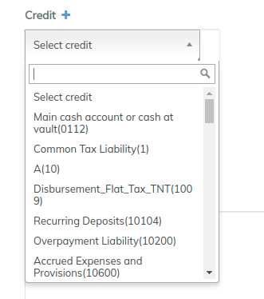
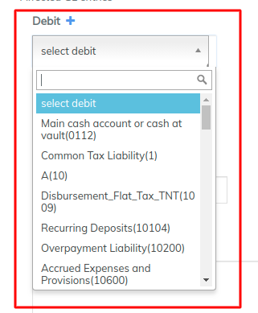
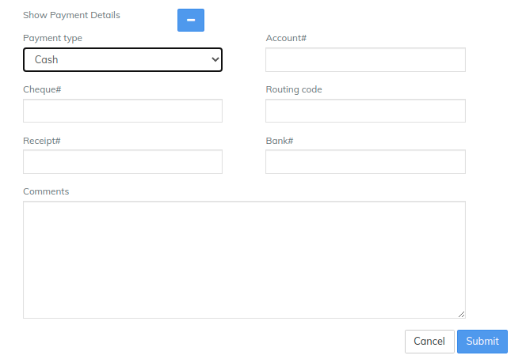

# Compound Journal Entries

### **Compound Journal Entries** 

To add a journal entry with multiple credits or debits, do the following:

1. On the LMS toolbar, click **Accounting** to open the Accounting menu.

.png>)

2\. On the Accounting menu, click **Add Journal Entries** to open the **Add Journal Entry** section.

.png>)

3\. In the **Add Journal Entry** dialog, enter the journal entry details:\
**NOTE: Fields with a red asterisk (\*) are required.**\
****

a. From the **Office** list, select the office where you want to add the journal entry.

b. From the **Currency** list, select the currency of the transaction.

c. Under **Affected GL entries**, add your journal entries:\
\
1\. To add credit entries to your General Ledger (GL):

2\. From the **Credit** list, select the credit type for the journal entry.

3\. In the **Amount** box, enter the amount you wish to credit.

4\. Click the plus button (**+**) to add another credit to your journal entry.

5\. Repeat until you have entered all credits for the journal entry.

a. To add debit entries to your General Ledger (GL)

b. From the **Debit** list, select the debit type for the journal entry.

c. n the **Amount** box, enter amount you want to debit.

d. Click the plus button (**+**) to add another debit to your journal entry.

e. Repeat until you have entered all debits for the journal entry.\
**Tip**: _To remove a credit or debit, click the (**x**) button to the right of the entry you want to delete._

In the **Reference number** box, you can enter a reference code.\
**NOTE**: **The Reference number box is an optional field.**\
****

1. To expand the **Show Payment Details** section**,** click the plus button (**+**).

Under **Show Payment Details**, you can enter further banking details:\
**NOTE**: **Payment details are optional.**

From the **Payment type** list, select the payment type for the journal entry.

Enter the Account#, Check#, Routing code, Receipt#, and Bank#. To collapse **Show Payment Details**, click the minus button (**-**).

In the **Transaction date** box, click inside the box and choose the date from the pop-up calendar. Use the left and right arrow keys beside the month and year to change the month.

1. Click the '**Submit'** button to post your journal entry.\
   \

2. Once you click on submit, you will be able to view a summary of the transaction. To reverse the transaction, click on the blue **Reverse** button at the top-right corner:

##
