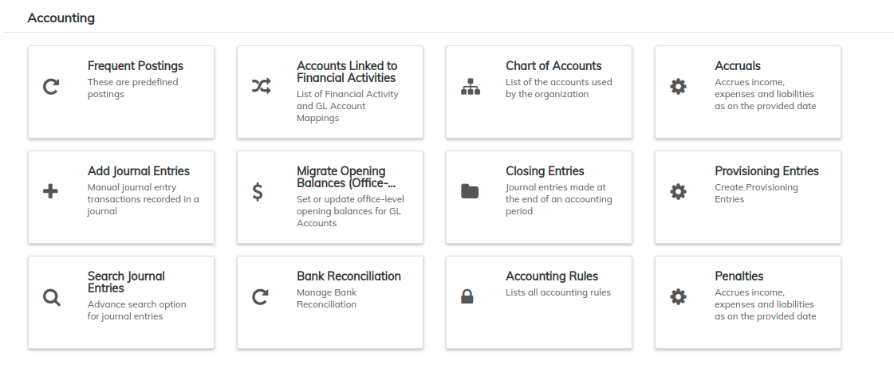
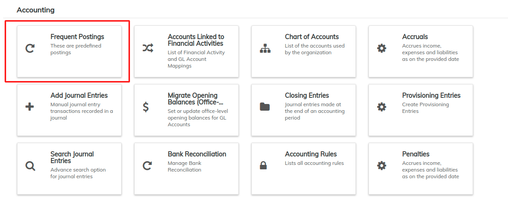
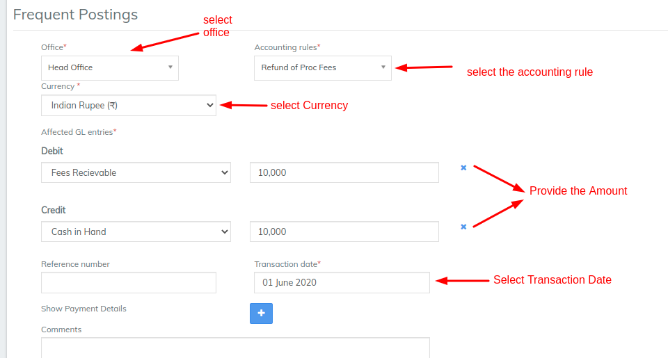

# Frequent Postings

## Frequent Postings 

Frequent Postings is an integral feature that ease an accountant's tasks and aid in reducing errors. They rely on pre-configured Accounting Rules, and thus the accounting transactions involving debit/credit accounts are predefined too.

This enables users with non-accountant roles to do transactions. By simply selecting an accountant rule and providing the transaction details, one can perform a transaction.

### **Adding Frequent Postings** 

order to add Frequent Postings, follow the steps below:

1. On the Welcome Page, click on the **Accounting** tab on the toolbar.

.png>)

**2.** This will open the **Accounting** menu.

3\. Select **Frequent Postings:**

**4.** Fill in the details as shown in the screenshot below:

5\. Once you have **provided the amounts** for the transaction, click on the '**Submit'** button. &#x20;

### **Viewing the Transaction** 

After clicking on the submit button, you can see a summary of the completed transaction with details:

.webp>)

## &#x20;

