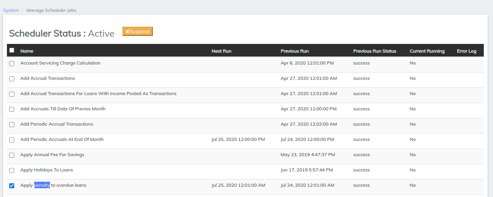
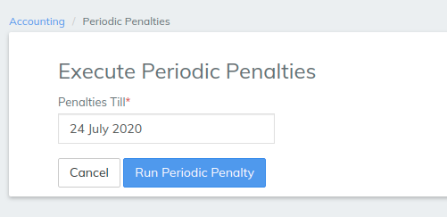
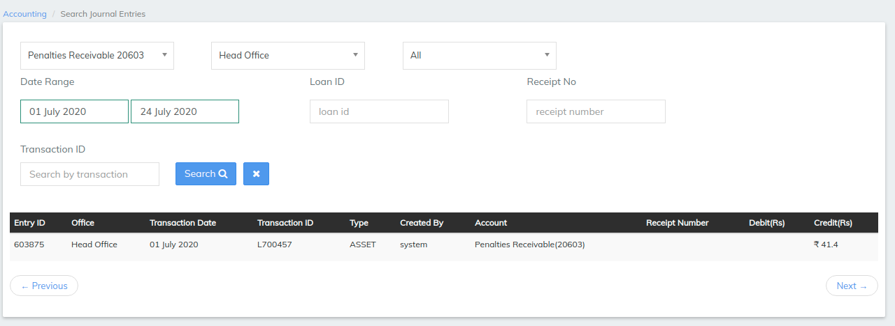
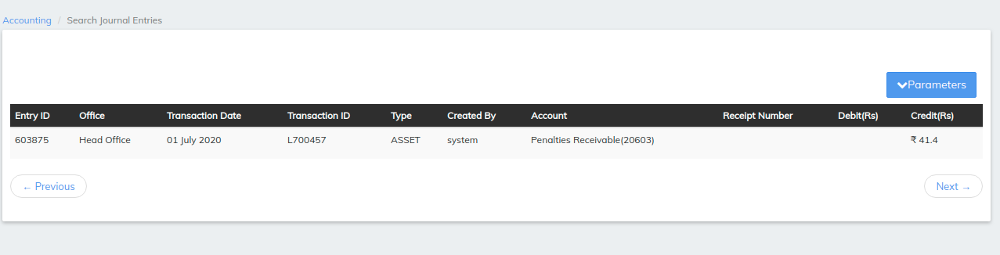

# Penalties

## Penalties

Go to **Admin** >> **System** >> **Scheduler Jobs** to see the following window (_with a list of Jobs_):

* Check the check boxes beside '**Apply penalty to overdue loans**' _(shown in the screenshot_ _above)._\
  \

* At the bottom of the page, click on the '**Run Selected Jobs**' button, followed by the '**Refresh**' button.&#x20;

.png>)

* Create a Loan Account for a Client/Group with the Loan Product having Penalties&#x20;
* Make a few transactions (_for instance: Repayments_).
* Then go to the **Accounting** >> **Accruals**. The following window will be displayed:

* Specify the date in the "**Penalties Till**" field.
* Finally, execute Periodic Penalty till specified date by clicking on the blue "**Run Periodic Penalty**" button in order to affect all the accrual accounts (f_or instance: Interest Receivable, Fees Receivable, etc._).

To see the entries in accrual accounts,

* Go to [**Accounting**](https://mifosforge.jira.com/wiki/spaces/docs/pages/101384453/Accounting) >> **Search Journal Entries**. The following window will be displayed:

As shown in the screenshot above, select the appropriate filters and duration and click on the '**Search**' button to see the accrual transactions that occurred during the specified duration.

