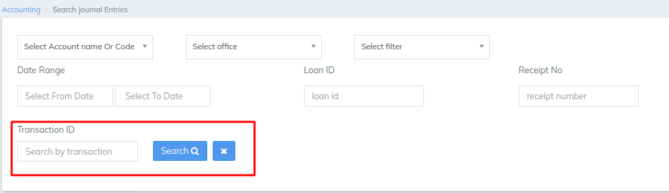
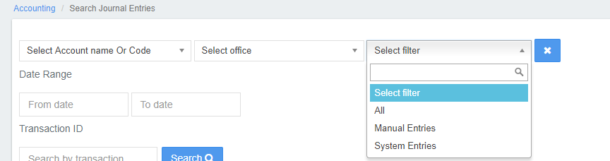
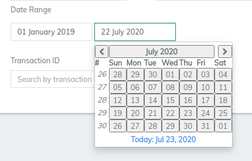
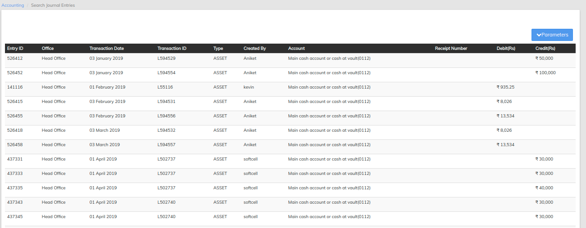
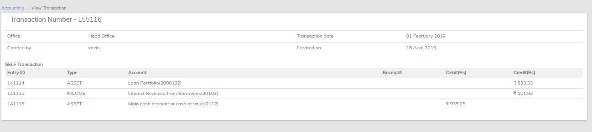
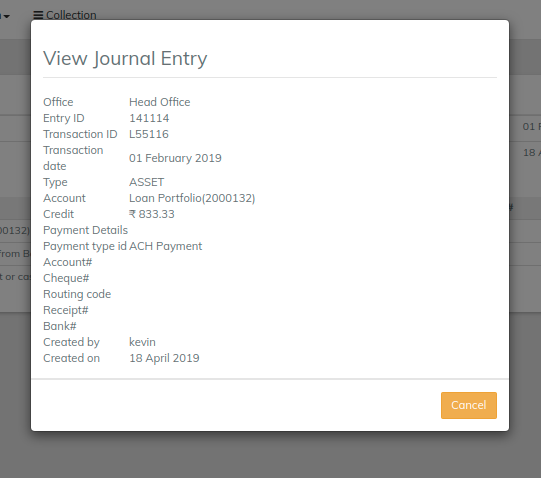

# Searching Accounting Transactions

## Searching Accounting Transactions

In LMS, you can search accounting transactions and view journal entry details.

You can choose to limit your search to only automated system journal entries or only manual journal entries.

When you select a journal entry, LMS lists all journal entries for the transaction. You can view the details for each journal entry.

#### Searching Automated Portfolio Accounting Entries 

To search automated journal entries:

1. On the LMS toolbar, click **Accounting** to open the Accounting menu.

.png>)

2\. On the Accounting menu, click **Search Journal Entries** to open the **Search Journal Entries** dialog.

3\. Click the down-arrow to show the search options.

4\. In the **Select Filter** list, click **System Entries**.

5\. Enter optional search details:

a. In the **Account name** box, enter an account name.\
**Tip:** As you type in the account name box, a list of accounts matching your entry is displayed. To select an account from the list, click on the account

b. In the **Office** list, select an office.

.webp>)

c. In the **From date** box, click in the box and then choose the date from the pop-up calendar. Use the left and right arrow keys beside the month and year to change the month

d. In the **To date** box, click in the box and then choose the date from the pop-up calendar. Use the left and right arrow keys beside the month and year to change the month.

6\. To view the details for a journal entry:

a. In the **Search Journal Entries** dialog, click a journal entry to show the **Transaction** dialog.

b. In the **Transaction** dialog, click a journal entry to show journal entry details in the **View Journal Entry** pop-up dialog.

c. To dismiss the **View Journal Entry** dialog, click the '**Cancel'** button.

##
