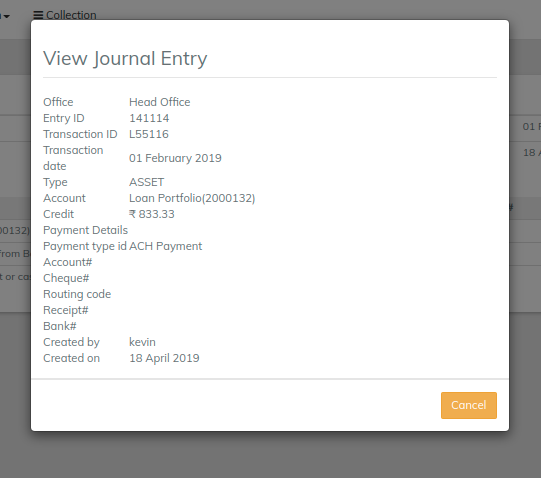

# Searching Manual Journal Entries

#### Searching Manual Journal Entries  

To search manual journal entries:

1. On the LMS toolbar, click **Accounting** to open the Accounting menu.

.png>)

2\. On the Accounting menu, click **Search Journal Entries** to open the **Search Journal Entries** dialog.

.png>)

3\. Click the down-arrow to show the search options.

.png>)

4 .In the **Select Filter** list, click **Manual Entries**.

5\. Enter optional search details:

a. In the **Account name** box, enter an account name.\
**Tip:** As you type in the account name box, a list of accounts matching your entry is displayed. To select an account from the list, click on the account.

b. In the **Office** list, select an office.

c. In the **From date** box, click in the box and then choose the date from the pop-up calendar. Use the left and right arrow keys beside the month and year to change the month.

d. In the **To date** box, click in the box and then choose the date from the pop-up calendar. Use the left and right arrow keys beside the month and year to change the month.

6\. To view the details for a journal entry:

a. In the **Search Journal Entries** dialog, click a journal entry to show the **Transaction** dialog.

b. in the **Transaction** dialog, click a journal entry to show journal entry details in the **View Journal Entry** pop-up dialog.

c. To dismiss the **View Journal Entry** dialog, click the '**Cancel'** button.

## &#x20;

