# Single journal Entries

### **Single Journal Entries** 

To add a credit/debit journal entry, do the following:

1. On the LMS toolbar, click **Accounting** to open the Accounting menu.

2\. On the Accounting menu, click **Add Journal Entries** to open the **Add Journal Entry** section.

3\. In the **Add Journal Entry** form, enter the journal entry details:\
**NOTE**: **Fields with a red asterisk (\*) are required**.\
\
1\. From the **Office** drop-down list, select the office where you want to add the journal entry.

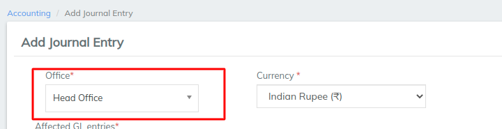

2\. From the **Currency** list, select the currency of the transaction.

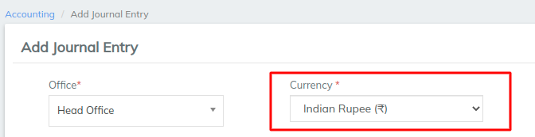

Under **Affected GL entries**, do one of the following:

To add a single credit entry to your general ledger (GL)

1. From the **Credit** list, select the credit type for the journal entry.

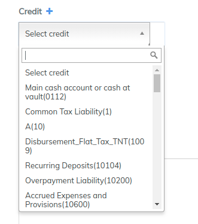

2\. In the **Amount** box, enter the amount you wish to credit.

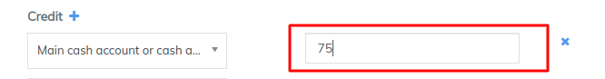

—OR—

To add a single debit entry to your general ledger (GL)

1.From the **Debit** list, select the debit type for the journal entry.

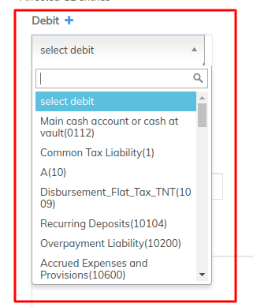

2\. In the **Amount** box, enter the amount you wish to debit.

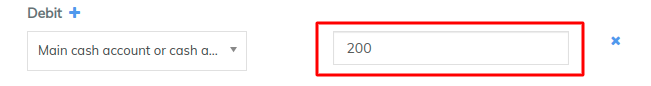

In the **Reference number** box, you can enter a reference code for the journal entry.\
**NOTE**: **Filling in the Reference number field is optional.**

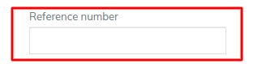

In the **Transaction date** box, click inside the box. A date picker will be displayed. Choose the date from the pop-up calendar. Use the left and right arrow keys beside the month and year to change the month.

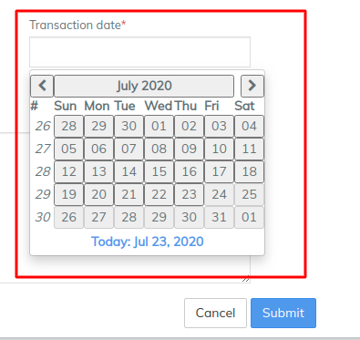

Under **Show Payment Details**, you can enter banking details:\
**NOTE**: **Payment detail boxes are optional.**

To expand the **Show Payment Details** section**,** click on the plus button (+).

From the **Payment type** list, select the payment type for the journal entry.

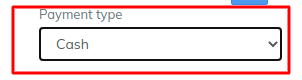

Enter the Account#, Check#, Routing code, Receipt#, and Bank#. To collapse the **Show Payment Details** section**,** click on the minus button (-).

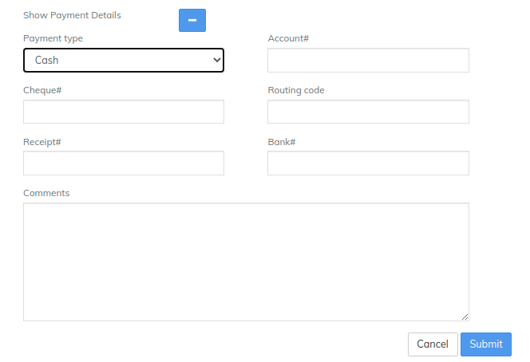

**4.** Click on **Submit** to post your journal entry.

5\. Once you click on submit, you will be able to view a summary of the transaction. To reverse the transaction, click on the blue **Reverse** button at the top-right corner:\

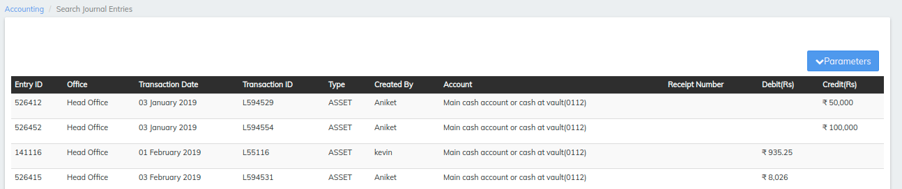

##
