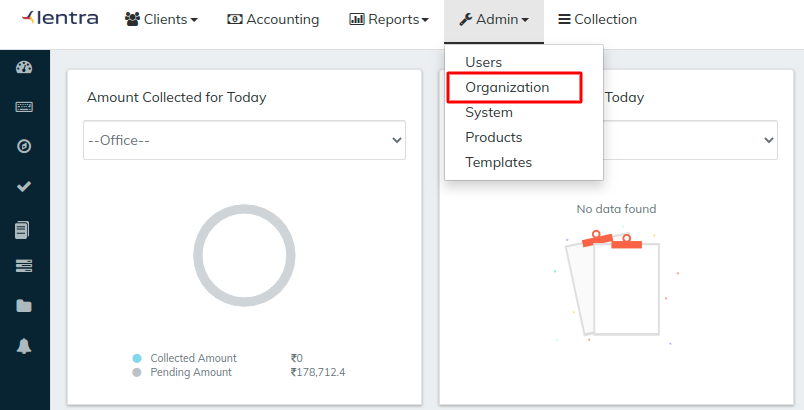
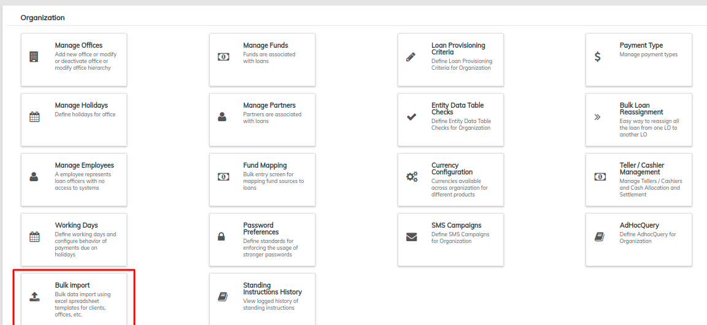
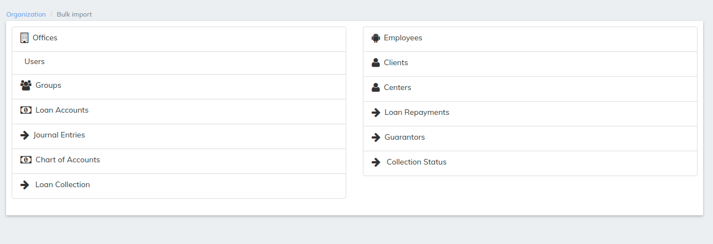

# Bulk Upload Module

Bulk import allows us to import info in bulk form that could be client which are existing in the lenders system and want to upload it in our system

\>> Find Admin tab on dashboard once logged into LMS then click on Organization

once the Organization tab is opened go to bulk import module

In bulk import module there are various options which can be imported in LMS can be seen in the below image and we will see those in sub pages under bulk upload module

##

## Import Clients

Existing Clients can be imported under this screen



