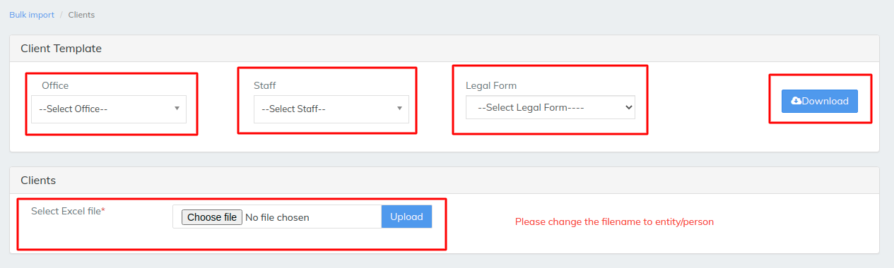
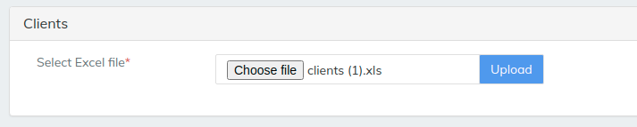
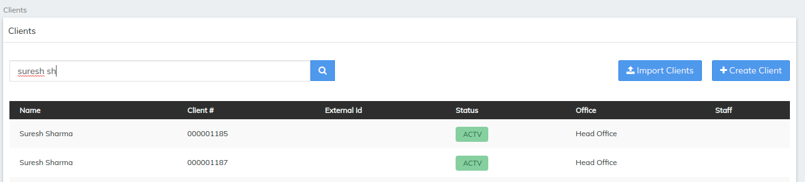

# Client

\>>To upload any data to LMS like Clients we need to download a template which LMS provides and fill the the details in template&#x20;

\>> then saved file should be uploaded in the LMS as we can see it in the below image

Select office for the clients to upload select staff accordingly and most important of all select the legal form that is if he is person or the entity , entity represents he is employee in the same firm  once the template is downloaded fill the necessary details&#x20;

above image is an example of 1 single Client is being uploaded to LMS multiple clients can be uploaded to LMS&#x20;

\>>Selected file will be shown once it is selected by choose file option then simply  hit upload. the uploaded file will reflect after we hit the refresh button it will shows the records uploaded and if any errors that is failure in the file it will reflect as failure as 1 refer image below

To see the Cleint we have uploaded in the LMS go to Cleint>>then in the search bar search for the name we have entered in the excel  then you can see the Client we have uploaded earlier. refer the image below


[import-clients.md](../client-transactions/import-clients.md)


