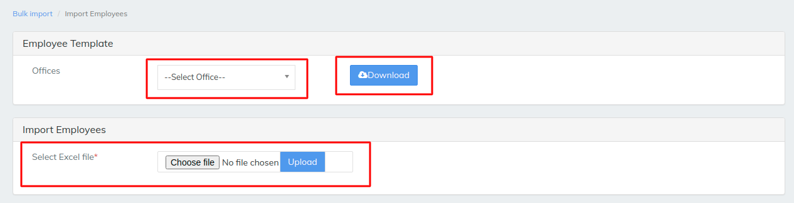
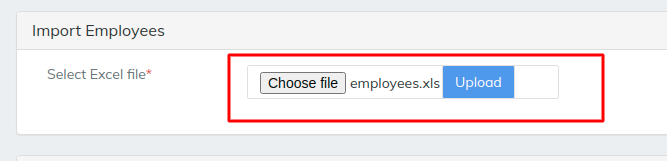
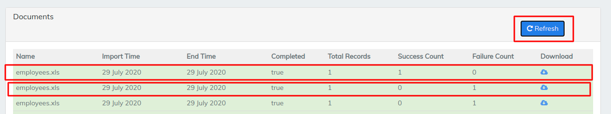
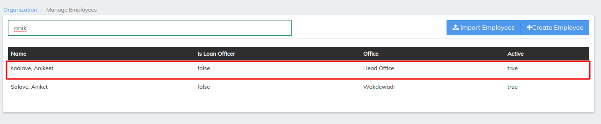

# Employee

To upload any data to LMS like Employees  we need to download a template which LMS provides and fill the the details in template&#x20;

\>> then saved file should be uploaded in the LMS as we can see it in the below image, for the Employees to upload in the LMS we need to select the office related to employee and then download the template

\>>once the template is downloaded fill the necessary details in the excel file downloaded&#x20;

The above image is an example of 1 Employee is being uploaded to LMS who is active currently and associated to head office

Selected file will be shown once it is selected by choose file option then simply  hit upload. the uploaded file will reflect after we hit the refresh button it will shows the records uploaded and if any errors that is failure in the file it will reflect as failure as 1 refer image below

\>>To see the office we have uploaded in the LMS go to Admin>>then go to Organization>>then manage Employee then you can see the Employee we have uploaded earlier refer the image below


[manage-employees.md](../../admin/administration/organization/manage-employees.md)


