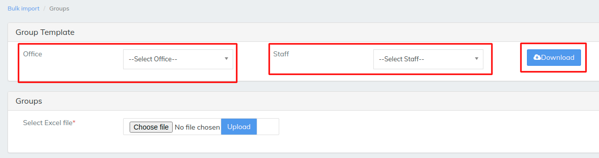
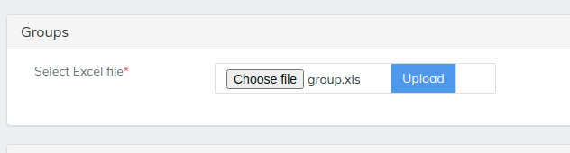
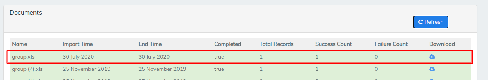
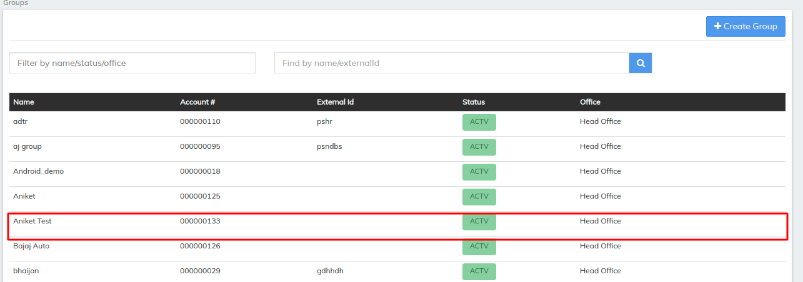

# Groups

\>>To upload any data to LMS like Groups we need to download a template which LMS provides and fill the the details in template&#x20;

\>> then saved file should be uploaded in the LMS as we can see it in the below image

Select office for the Group to upload select staff accordingly and once the template is downloaded fill the necessary details&#x20;

above image is an example of 1 single Group is being uploaded to LMS multiple Groups can be uploaded to LMS&#x20;

\>>Selected file will be shown once it is selected by choose file option then simply  hit upload. the uploaded file will reflect after we hit the refresh button it will shows the records uploaded and if any errors that is failure in the file it will reflect as failure as 1 refer image below

To see the Group we have uploaded in the LMS go to groups>>then in the search bar search for the name we have entered in the excel  then you can see the Group we have uploaded earlier. refer the image below


[manage-groups.md](../../admin/client-management/manage-groups.md)


