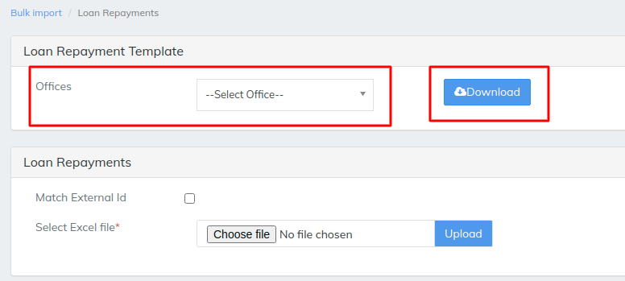

# Loan Repayments

\>>To upload any data to LMS like Clients we need to download a template which LMS provides and fill the the details in template&#x20;

\>> then saved file should be uploaded in the LMS as we can see it in the below image

Select office for the Loan repayments to upload once the template is downloaded fill the necessary details&#x20;

above image is an example of 1 single Loan Repayment is being uploaded to LMS multiple clients can be uploaded to LMS&#x20;

## Common mistakes in payment Bulk Upload

1-Make sure that all the mandatory parameters are filled.&#x20;

2-Loan whose payments is being uploaded should be "Disbursed" state.&#x20;

3-Instrument type should be correctly mentioned.&#x20;

4-Installment date should match with the EMI date in the loan collection.&#x20;

5-The status change of collection should be in a correct flow(i.e We cannot change the status of a not-registered NACH to "Demand Generated" )&#x20;

6-The status change should follow the status flow of the underlying collection type.&#x20;

7-The transaction date should not be less than the last transaction date in the respective loan.

