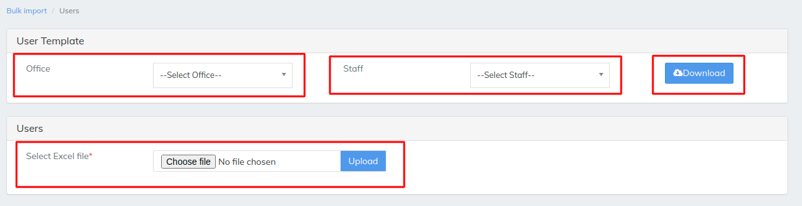
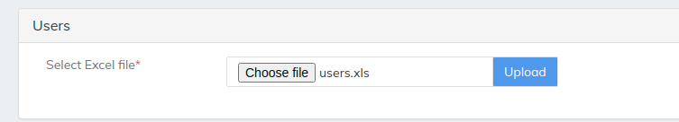
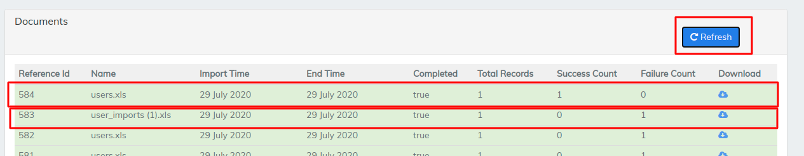
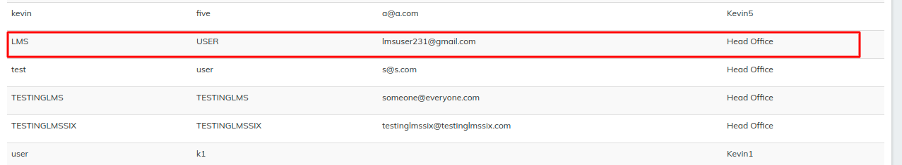

# Users

\>>To upload any data to LMS like Users we need to download a template which LMS provides and fill the the details in template&#x20;

\>> then saved file should be uploaded in the LMS as we can see it in the below image

Downloading the template for users will ask for select office and select staff, once  the template is downloaded fill the info in all columns and save the template&#x20;

\>> the above image shows the single user is being added as LMS can add multiple users at a same time without conflicting&#x20;

Selected file will be shown once it is selected by choose file option then simply  hit upload. the uploaded file will reflect after we hit the refresh button it will shows the records uploaded and if any errors that is failure in the file it will reflect as failure as 1  and error file  can be downloaded via cloud symbol located besides failure count  refer image below

\>>To see the office we have uploaded in the LMS go to Admin>>then go to Users>> then you can see the User we have uploaded earlier refer the image below


[users.md](../../admin/administration/users.md)


