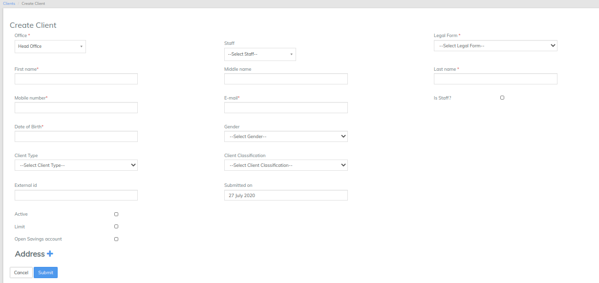

# Create Client

### Client Fields



* Office - For which office the Client is associated
* Staff - The relationship manager assign to Client
* Legal Form - It can be Person or Entity , Entity i.e Employee of the Firm
* First Name
* Middle Name
* Last Name
* Mobile No&#x20;
* Email ID
* Submitted On Date - On which date the client is submitted to the Company
* Date Of Birth
* Gender&#x20;
* Client Type - Salaried , Company, Business
* Client Classification - PVT LTD, LLP
* Activation Date - on Which Date the Client is Activated




* **Revolving** -  **Revolving** credit is a type of credit that can be used repeatedly up to a certain **limit** as long as the account is open and payments are made on time. With **revolving** credit, the amount of available credit, the balance, and the minimum payment can go up and down depending on the purchases and payments made to the account.
* **Non Revolving -** A non-revolving line of credit is a line of credit that can’t be used again after it’s paid off. The only difference between a non-revolving line of credit and a revolving line of credit is what happens to your available funds after you’ve made a repayment to your account.




## Create New Client 

It is the policy of (ENTER YOUR ORGANIZATION’S NAME HERE) to encourage systematic savings for all clients.  We are commited to the financial well being of our clients through quality service delivery and ongoing financial educational opportunities.

It is the portal to all of the clients’ financial benefits.  There is a XXXX minimum to open the account.&#x20;

**Forms**

(LIST THE FORMS USED BY YOUR ORGANIZATION)

Membership Application & Admission

Clients Agreement

Daily Deposit Passbook

**Procedure**

1. Give the client the Membership Application and Admission form.  Have the member complete and sign the New Account Application to include the selection of bank services desired.
2. Take a photograph of the Identification card or Passport ID page.
3. Log onto the LMS system.  From the opening screen, click on the “Clients” drop down. A list of existing clients will appear.&#x20;
4. Click on the +Create Client button.&#x20;
5. Enter the correct information in each field of the Create Client screen.
6. Select your name from the Staff drop down menu.
7. Review the information for accuracy and select “Submit”.  NOTE:  do not activate the account until the application has been reviewed and approved by the (MEMBERSHIP OFFICER).
8. The system will navigate to the main client information screen.  Take a photograph of the member using the computer’s webcam.  (If there are technical difficulties, snap a photo of the member and upload the file).
   1. On the blue navigation bar, select the More dropdown.
   2. Select “Upload Client Image” from the drop down.
   3. Select the file of the image just captured.
9. If you have captured the client’s signature:
   1. On the blue navigation bar, select the More dropdown.
   2. Select “Upload Client Signature” from the drop down.
   3. Select the file of the image just captured.
10. Select the “Identity Documents” tab then select “+Add.”
11. In the drop down window, select the type of document.
12. Enter the Unique Identification # found on the ID.
13. Enter a brief description of the document.&#x20;
14. Click on “Documents”, select “+Upload.”  Browse the system for the membership application.  Note: This file can be uploaded from a scanned file, or a photograph of the document can be taken and uploaded.
    1. NOTE:  this is a temporary file only.  After Membership Committee Action, this file will be replaced with the completed form with all Committee action noted.
15. File the paper copy of the Membership Application in the folder for review by the Membership Committee at their next regularly scheduled meeting.
16. If the Committee approves the application, sign into the LMS system, open the client account screen and click on the “Notes” tab.  Enter the notes as they appear on the membership application, then click on the Add button.&#x20;
17. Click on the General tab, then in the blue navigation bar. Click on “Activate.” Enter the activation date.
18. If the Committee approves the application, take a photograph of the front and back of the application then upload into the LMS system.
19. Open the Client Main screen, click on the “Client Documents” tab.  Delete the original Membership Application that was submitted to the Membership Committee.  Upload the completed and approved Membership Application.
20. Return to the “General Tab” to open the Savings Account.

