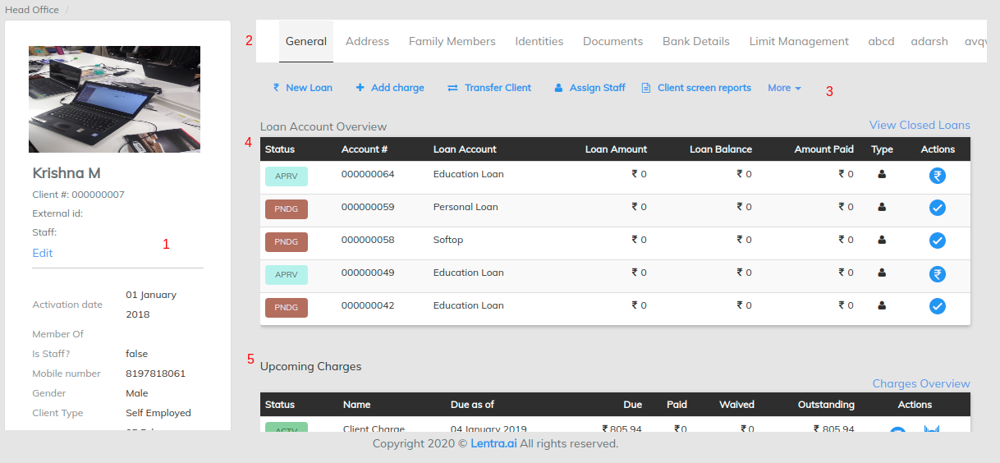
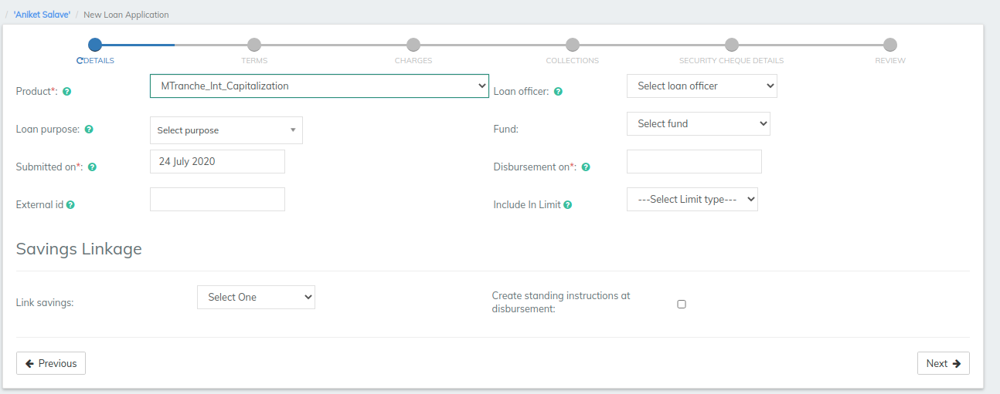
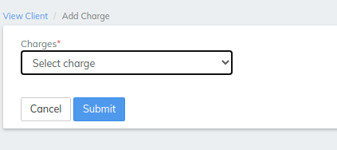
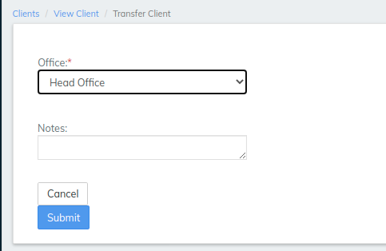
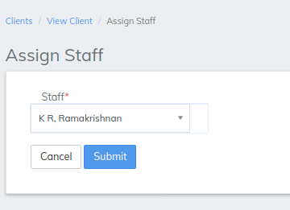
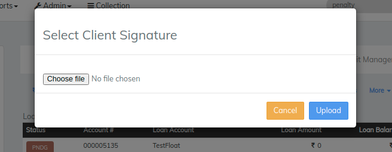
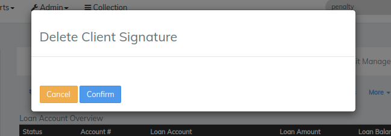
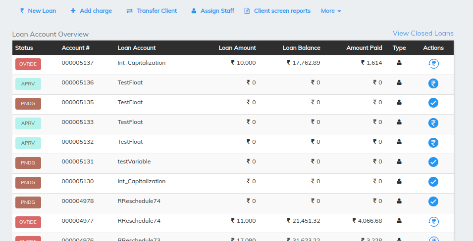

# Client Screen Overview

Our LMS system tries to provide 360 customer view in a single client screen. The screen has main 5 sections

1. Client Information: Client information contains below fields([Maintain Client Info](untitled.md))
2. Information Tabs:&#x20;
3. Client Servicing Options
4. Active loan account table
5. Client level charges&#x20;

### Information Tabs

*   **General Tab -** General Tab shows the information like no of loans which are in Active, Pending, or in Overdue State &#x20;

    and also provides other options those are New loan, Add charge, transfer Client, assign Staff, More. (for reference - [Maintain Client Info](untitled.md))

.png>)

__

### Client Servicing Options

_New Loan_ - this will help to create new loan application for a client

### Client Level Charges

2\. _Add Charge_ - Charge can be added to a loan  by this option (creating charge for loan level click on [Charges](../../admin/products-1/charges.md#loan-charge))

3\. _Transfer Client -_ Clients can be transferred  within offices ex- if it was in head office earlier it can go to regional office as we can see in the below image. select the office from offices drop down list, provide a note(Optional) and hit submit

4\. _Assign Staff -_ Staff or a relationship manager is assigned via this option&#x20;

5\. _More -_ The drop down list includes closing of loan , survey, Upload client signature, Delete Client Signature, Generate Cibil report etc.

* Upload client signature - system will ask to choose file from your system to upload a clients signature (see the image below ). Uploaded signatures can be viewed in Document tab.&#x20;

* Delete Client Signature - simply Delete the client signature&#x20;

**Active Loan Account table** - Active loans will be seen here for the particular Client

