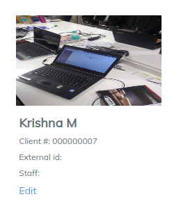
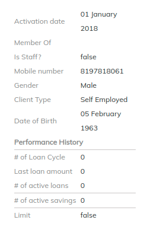
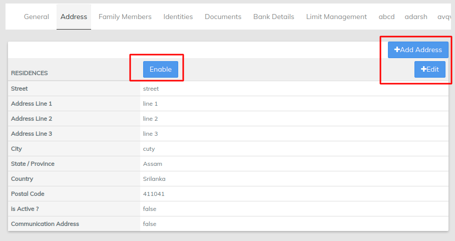
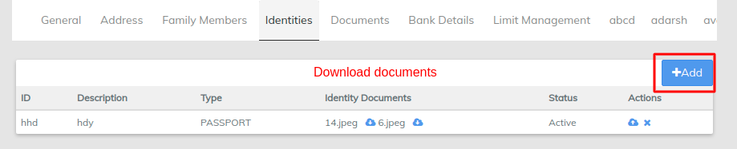
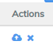

# Maintain Client Info

Client summary

1. Client name - name of the Client&#x20;
2. Activation Date - the date on which the client is activated in the system
3. Limit - 1) Revolving Limit -  **revolving** credit account sets a credit **limit**—a maximum amount you can spend on that account. You can choose either to pay off the balance in full at the end of each billing cycle or to carry over a balance from one month to the next, or "revolve" the balance.                                2) Non-Revolving Limit - it basically means the **credit** facility is granted on one-off basis and disbursed fully. The borrower will then make installment payments back against the principal **loan**. The most common form of **non**-**revolving credit** facility would be the unsecured business term **loan**.
4. Max Limit - The maximum loan amount can be disbursed to a client
5. Available Limit - The available loan amount which can be disbursed&#x20;
6. Client Type - it differs to salaried, business, student, company which gives the Idea of the client if he is salaried businessman and so on&#x20;
7. Edit client - can edit the client info which have entered earlier  follow the below image&#x20;

* **Address tab** - **** This tab contains the information of address entered in the system for a client, includes residence address. Also can Edit the existing address and can add address as well.

\>>clicking on Add address will open a screen to provide new address by selecting address type(residential, permanent)&#x20;

\>>Clicking on Edit Address will open a screen to edit the existing address as we can see in the below image it does not have address type as we are editing existing address

**Family Members** - Family addresses can be added through this tab as we can see in below image

\>>Family address can be edited and can be deleted LMS has a button in family address tab for the same. Multiple addresses can be added and can be removed&#x20;

**Identities** - Identities such as passport, Voter ID , PAN Card, AADHAR can be added here

Clicking on +Add button will open new screen (As shown below) and will ask to select type and status then simply submitting it will add a clients identity to LMS

.png>)

**Actions:**  - gives an option to download the document or remove the particular document from LMS

[Documents](upload-documents.md) - Client signature like documents will preserved under this tab , as we have seen the client signature upload in More option , Document tab shows the uploaded documents list and also give an option to download the document or remove the particular document from LMS


[upload-documents.md](upload-documents.md)


**Bank Details** - Clients bank details will be seen under this tab can add the bank details and can disable the bank details as well.

\>>Clicking on Add bank details will leads to new screen where the mandatory fields has to filled like IFSC, bank name.

\>> Select disbursement account mention account no and submit
