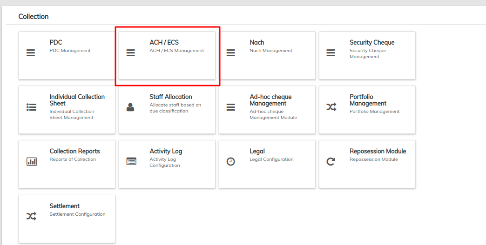
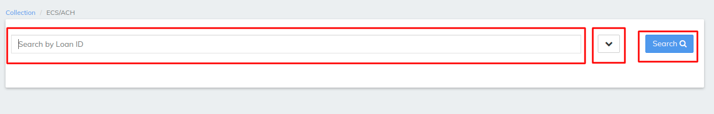

# ACH / ECH Management

**ACH** transfers are a way to move money between accounts at different banks electronically. They enable you to send or receive money conveniently and securely. ... **ACH** transfers have many uses and can be more cost-efficient and user-friendly than writing checks or paying with a credit or debit card.

\>> once you have logged in to LMS find collection TAB , >>once you clicked on the collection find ACH / ECH Management&#x20;

In ACH / ECH Management LMS offers search by Loan ID will pull the ECH for particular loan ID as shown in the below image

Filter button besides search button will opens multiple options like search by bank name cheque no cheque name , Payment type, office code and many more via we can search particular ECH for the loan refer image below

Normal search button will pull all the records for the ECH in the above image we can reset the filter to default which is by default in search that is all records will be viewed , once the search button is clicked the records will be shown as below

\>>Same as we seen in loan level [Loan Screen Overview](../loan-transactions/loan-screen-overview.md#4-detail-tab) the collection can be managed  that is we can select the particular repayment and can chaged it to the state we want also CV file can also be exported from here as we can see in the above image

