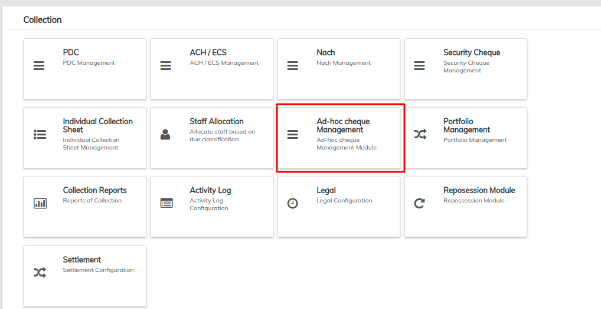
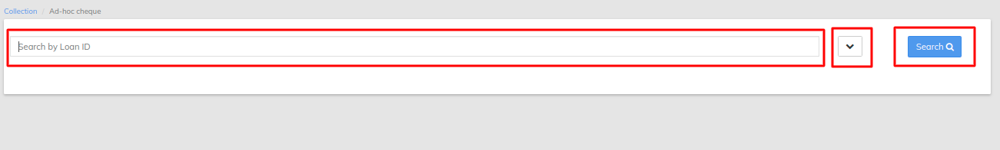
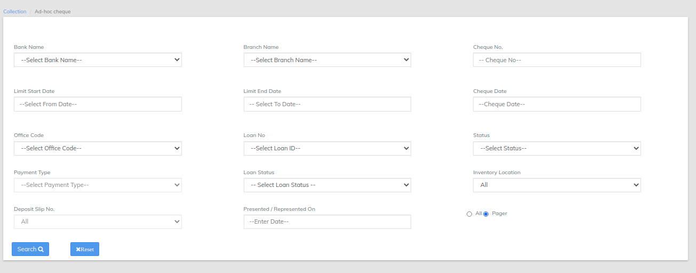

# Ad-hoc cheque Management

**Adhoc payment** transaction, users can initiate **payments** without maintaining payees. User is expected to enter the payee details manually along with the **payment** details to initiate a **payment**.

\>> once you have logged in to LMS find collection TAB , >>once you clicked on the collection find NACH Management&#x20;

In Nach Management LMS offers search by Loan ID will pull the Ad-hoc Cheque for particular loan ID as shown in the below image

Filter button besides search button will opens multiple options like search by bank name cheque no cheque name and many more via we can search particular Ad-hoc for the loan refer image below

Normal search button will pull all the records for the Ad-hoc in the above image we can reset the filter to default which is by default in search that is all records will be viewed , once the search button is clicked the records will be shown as below

same as the collection can be updated via selecting particular transaction and change the status from the drop down list&#x20;

