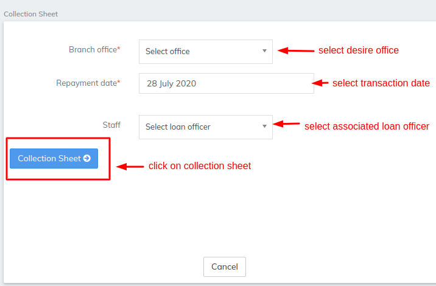
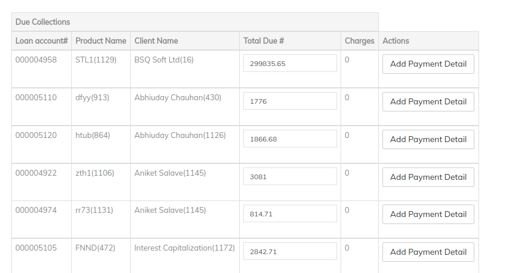

# Individual collection sheet

This section describes the steps to record a repayment on an Individual loan account.&#x20;

For repayments of client loan accounts see [How to Make Repayments on a Client Loan Account](../loan-transactions/how-to-make-repayments-on-a-client-loan-account.md)&#x20;

Go to the left panel side bar and click on 'Individual Collection Sheet'.&#x20;

The following window appears:- &#x20;

**Branch Office -** Select desired office.&#x20;

**Repayment date -** Select respective repayment date.&#x20;

**Staff -** Select associated loan officer, if the loan officer is not associated you could skip this selection.

Then click on **Collection sheet** button.&#x20;

The following window appears:- &#x20;

All the individual expected repayment amounts are automatically shown in this sheet here.&#x20;

As you can see in the screenshot above:-

* Loan and charges due collection row. With respect to the loan account, total due is the expected loan repayment column and charge is the expected charge to be paid row.
* In the row below, you can see the savings dues to collected columns.&#x20;

You can also use add payment detail in case you want to capture additional payment details.&#x20;

