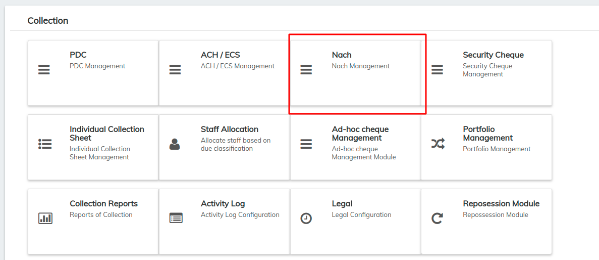
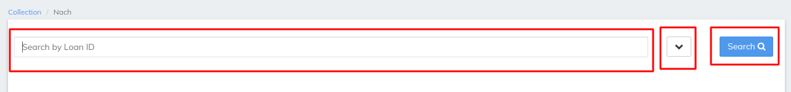
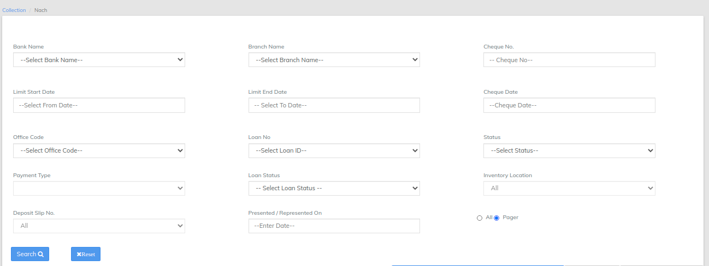
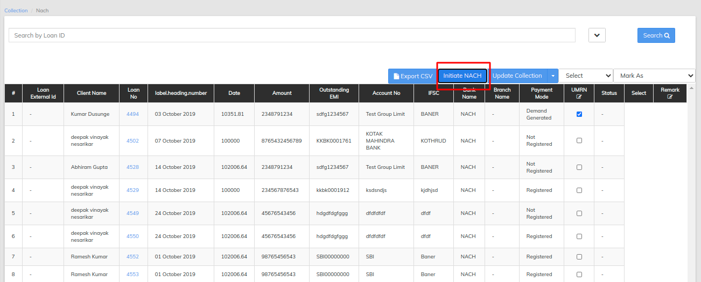
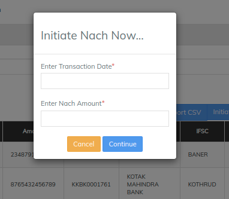

# NACH management

**NACH** Credit is an electronic **payment** service used by an institution for affording credits to a large number of beneficiaries in their bank accounts for the **payment** of dividend, interest, salary, pension etc. by raising a single debit to the bank account of the user institution.

\>> once you have logged in to LMS find collection TAB , >>once you clicked on the collection find NACH Management&#x20;

In Nach Management LMS offers search by Loan ID will pull the NAch's for particular loan ID as shown in the below image

\>>Filter button besides search button will opens multiple options like search by bank name cheque no cheque name and many more via we can search particular NACH for the loan refer image below

\>>Normal search button will pull all the records for the NACH in the above image we can reset the filter to default which is by default in search that is all records will be viewed , once the search button is clicked the records will be shown as below

same as the collection can be updated via selecting particular transaction and change the status from the drop down list&#x20;

in NACH management LMS also have initiate nach button which will allow you to initiate nach transaction simply putting the transaction date and amount for Nach, refer the image below which will appear once we click on button initiate Nach

once the nach is initiated updating collection will reflect the Nach in collection tab&#x20;

