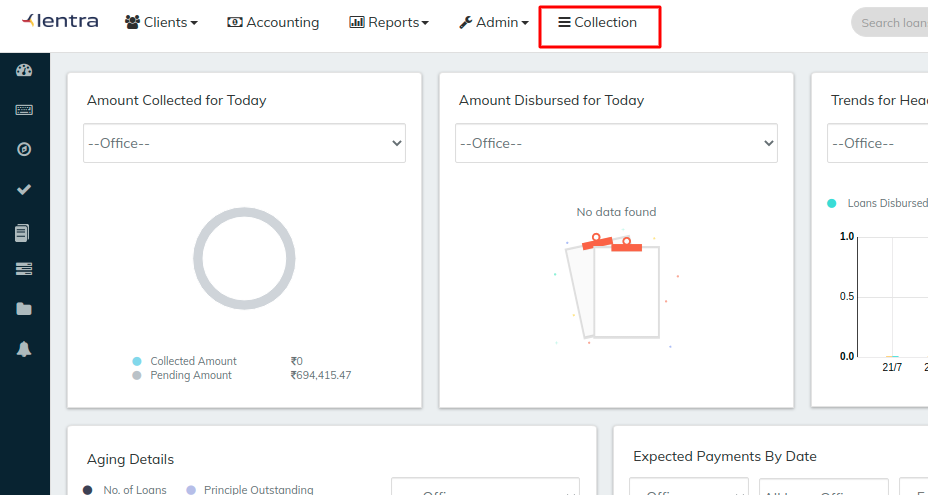
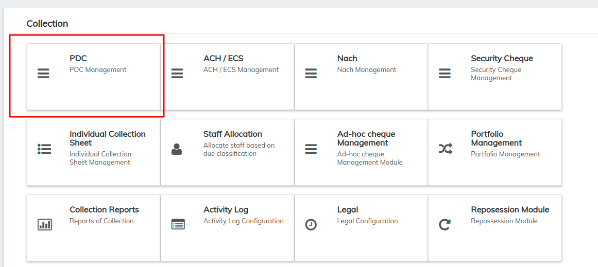
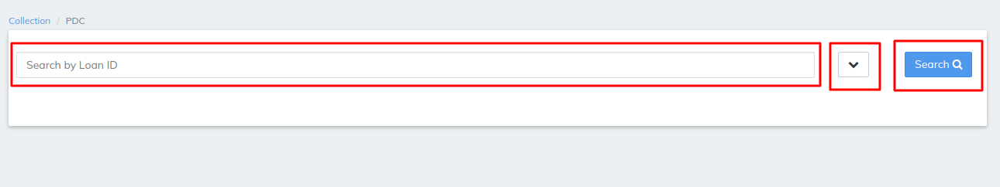
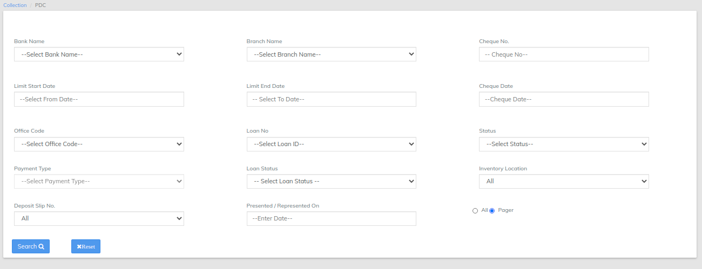

# PDC Management

**Post Dated Cheques** (**PDC**) Management. It is a standard banking practice in some countries to request **post-dated** checks for the retail Loan repayments. ... **Post dated** checks can also be used for payment in the realization for the Loan . Security checks are used only when the account becomes non-performing.

\>> once you have logged in to LMS find collection TAB&#x20;

\>>once you clicked on the collection find PDC Management&#x20;

In PDC Management LMS offers search by Loan ID will pull the PDC's for particular loan ID as shown in the below image

\>> Filter button besides search button will opens multiple options like search by bank name cheque no cheque name and many more via we can search particular pdc's for the loan refer image below

\>> Normal search button will pull all the records for the PDC in the above image we can reset the filter to default which is by default in search that is all records will be viewed , once the search button is clicked the records will be shown as below

\>> Same as we seen in loan level [Loan Screen Overview](../loan-transactions/loan-screen-overview.md#4-detail-tab) the collection can be managed&#x20;

Repayment Using Collection To call the repayment api after a collection status is changed

* Configure the PDC/ACH Repayment Triggers from configurations
* Set the state in which repayment should occur to active(Eg. Cleared).
* Now when the collection is changed to the state specified above(Eg. Cleared) the repayment api is called.

For Swapping.

An Already existing collection can be swapped with new collection from 1) The Collection Tab in Loan Screen 2) From the Collection Module

* To swap the collection, select the collection and proceed to the drop down near the update collection button.
* Then press swap collection
* The screen that opens, enter details of the new collections and click on swap.
* If a swap charge was associated with the loan, a charge is added automatically after the collection is swapped.

&#x20;

