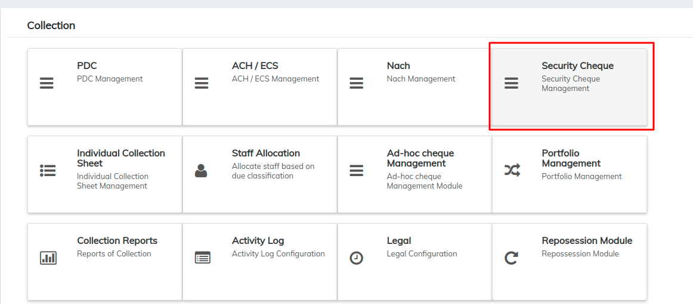
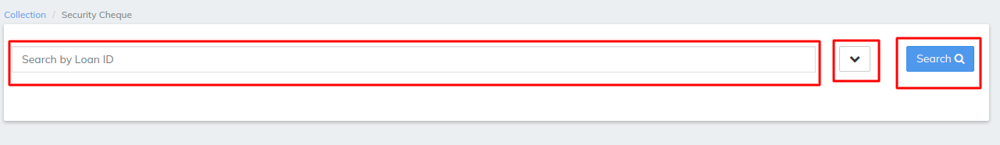
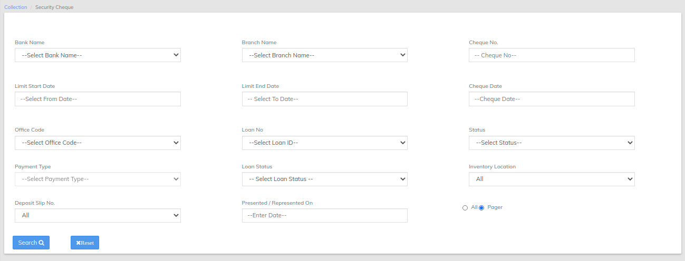
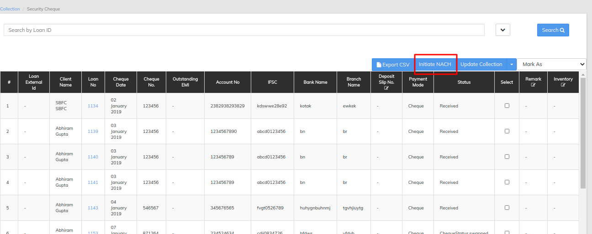

# Security Cheque

A **Security Cheque** is a **cheque** issued to a drawee as **security** or surety, for using in case the drawer fails to meet the future obligations arising during course of business or any other such transactions

once you have logged in to LMS find collection TAB , >>once you clicked on the collection find Security Cheque

In Security Cheque LMS offers search by Loan ID will pull the Security Cheques for particular loan ID as shown in the below image

\>>Filter button besides search button will opens multiple options like search by bank name cheque no cheque name and many more via we can search particular Security cheque for the loan refer image below

\>>Normal search button will pull all the records for the Security Cheque in the above image we can reset the filter to default which is by default in search that is all records will be viewed , once the search button is clicked the records will be shown as below

same as the collection it can be updated via selecting particular transaction and change the status from the drop down list&#x20;

in Security cheques LMS also have initiate nach button which will allow you to initiate nach transaction, select a particular repayment and the hit initiate nach it will change the repayment status to demand generated in collection then we can submit the collection by hitting the update collection button.
