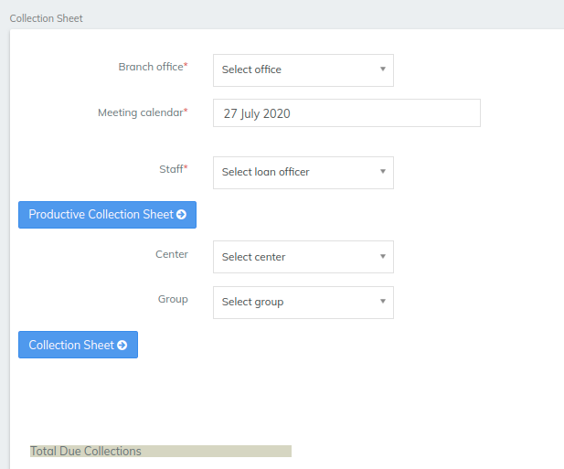
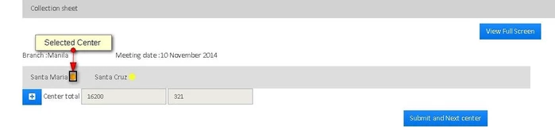
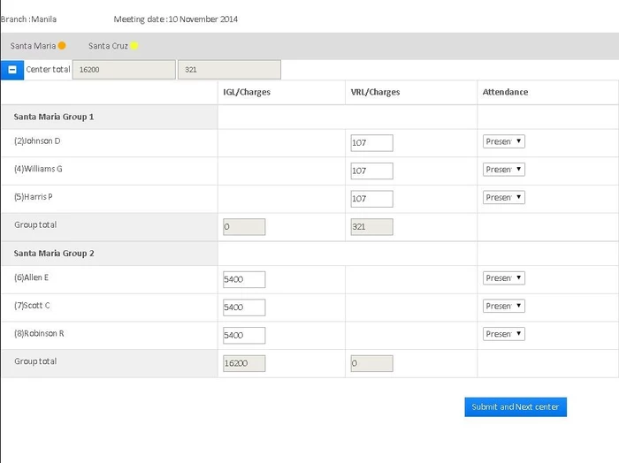
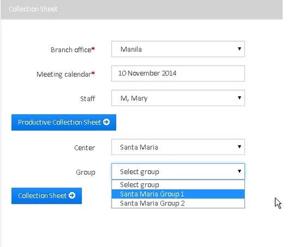
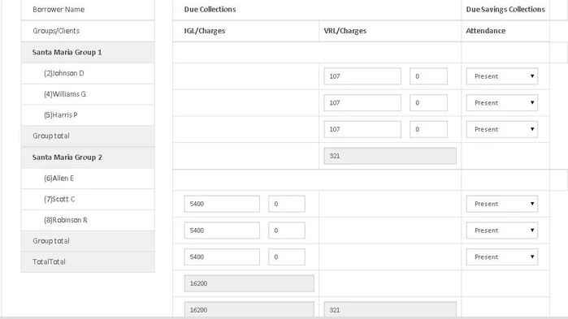
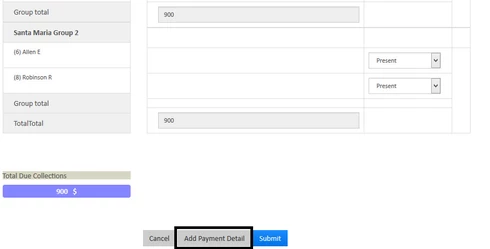

# Using Productive Collection Sheet

## Using Productive Collection Sheet

* Go to the left panel and click on 'Collection Sheet'.

* The following window appears, provide office name, meeting date and staff.

* Click on 'Productive Collection Sheet' to see the following window where you can select the center (The selected center is shown with Amber color). It also shows Branch Office Name, Meeting Date and center total collection for the given meeting date in terms of loan product. Here, 16200 is the collection for one loan product and 321 is the collection for the other loan product.

* Click on  button to see the details of the collection group-wise and client-wise for the selected center as shown below or you can simply click on 'Submit and Next center' button.&#x20;

* As you can see, there are two groups and each group with their three clients. IGL is the loan product (short name) for the group 'Santa Maria Group 2' and VRL is the loan product for the group 'Santa Maria Group 1'. You can see 'Due' for each client as well as the due for each group and you can also see Attendance where using drop-down menu, you can select whether the client is present, Absent, Leave, Late or Approved.
* Once you verify that all the details are correct, you just click on 'Submit' button.&#x20;

#### Using Collection Sheet: 

* Go to the left panel and click on 'Collection Sheet' to see the following window

* Provide all the details (Selecting Group is optional. If you select the group, the collection sheet for that group is shown only, otherwise the collection sheet for all the groups for the selected center will be shown) and click on 'Collection Sheet' button to see the following window. 

* Just like the previous one, verify the details and click on 'Submit' button. If everything goes fine, You will get the message "Collection Sheet Saved Successfully".&#x20;

#### Capturing payment details for collection sheet:  

Step 1) Define payment types in Admin >> Organization >> Payment type, as shown in the screenshot below.&#x20;

Step 2) Click on collection sheet:             a - Select "Branch office",              b - Select Date - "Meeting calendar",             c - Select "Staff",             d - Select "Center",              e - If required select "Group".Click on "Collection sheet"Step&#x20;

3\) Once the collection sheet gets generated, at the bottom you would find: "Add payment type" button, Click on that. Step&#x20;

4\) In Payment type: By Inputting required fields you can capture details i.e Payment type, Account #, Receipt #, etc.


Note: As of now, for Productive collection sheet "Add payment type" is not available in the present version.&#x20;


