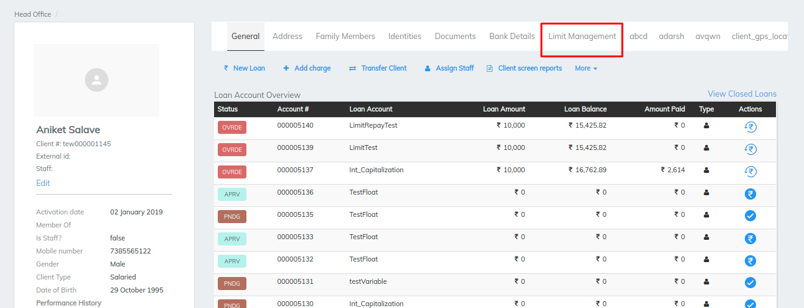

# Limit Management

limit is the maximum dollar amount that a single bank can lend to a given borrower.

The limit has to set to client first if not then the we can not disbursed a loan through a limit. Client limit is given while creation of client it is revolving or non revolving for reference [Create Client](client-transactions/import-clients.md#client-fields)

### Limit Creation&#x20;

While disbursing a loan  after selecting a product we need to select include in limit  which are created in manage codes earlier it is shown in below image

\>>after selecting it disbursed a loan and go to client page and find Limit management tab under which  limit is created&#x20;

\>> go to limit management tab and click on option Add Limit if already created then can edit limit as well&#x20;

\>> Clicking on Add limit will ask for limit name, limit amount, Limit start date, limit end date which are mandatory fields as we can see in above image then hit save&#x20;

Limit Details will show the limit we have created and can edit the limit from the same tab by clicking on Edit button&#x20;

### Dropline Limit Creation

Dropline limit will keep on decreasing with the frequency defined. Example: If Limit is 100000 and a yearly dropping limit, then every year 20000 will decrease from the limit&#x20;

Apart from the normal limit setting user can also set a drop limit functionality&#x20;

* By enabling the option of the drop limit mentioned below are the parameters that needs to be filled
* Dropping amount: Amount that we need to reduce from the original limit
* Dropping Start date: start date for dropping
* Dropping End Date: end date for dropping
* Dropping Frequency (In months): Frequency in months after which the dropping will take place.&#x20;

.png>)

### Limit Screen

Limit screen contains overall details like un-allocated amount, no of active loans   current limit, unutilized limit, current balance, no of loans, overdue loans, excess payment etc. refer below image&#x20;

* No of loans - count of loans disbursed in the limit
* No of active loans - Active loans in the limit&#x20;
* Current limit - Available limit amount after disbursing loans&#x20;
* Current balance - Balance available in limit that is the amount remaining in the limit which can be disbursed&#x20;
* overdue loans - the loans which are remaining unpaid past their due (or maturity) date
* Excess payment - the excess payment paid

\>> Same as loan summary the details that are principal paid, interest paid, fees, waived or written off, outstanding, overdue are mentioned in limit screen for the loans disbursed through a created limit

1. _View Payment History  -_&#x20;
2. _. Repay -_  On click on 'Repay ' three input (Amount to Allocate / Transaction Date / Allocation Type) these inputs will be asked by LMS amount to be allocated and transaction date and allocation type

\>>User will input the amount and date and select the allocation type of the options (FIFO / LIFO / Manual)

### **Allocation by**

_Manual_ - Amount allocation will be manual it will select the overdue amount for the loan from the input given by the user

\>>manual payment the transaction amount and allocated amount should be matched ,refer below image

_FIFO\_EMI\_WISE_ - according to the EMI\_WISE it will select all the overdue EMIs in the limit among no of loans in the limit, based on the input amount and paid them. refer below image &#x20;

_FIFO\_LOAN\_WISE_ - According to the first loan which is in overdue among no of loans in limit will be paid first from the input amount and then second loan and so on but respective to date which end user provided. refer below Image

