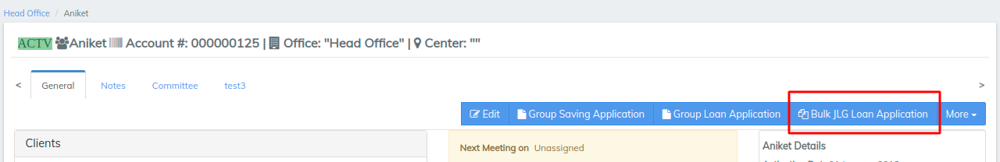
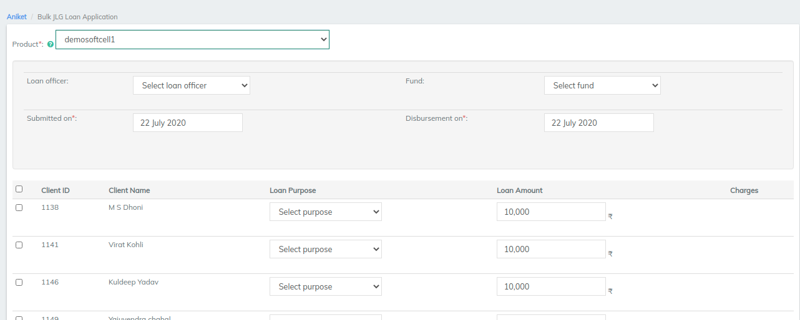

# Loan Servicing

## Introduction 

Loans in microfinance are typically given out for:

* Micro-enterprise loans
* Agricultural loans
* Housing Improvement loans

### Loan Application Process 

The process of attaining a loan from an MFI begins with a **loan application**.

1. An MFI will have some financial credit service offering or **loan products** that may be suitable for a range of customers.
2. Potential customers (loan applicants) who are interested in praticular **loan product** will **submit a loan application** (most likely through the help of a **loan officer**)
3. This loan application will be reviewed. The loan application process can differ widely from MFI to MFI depending on their business process and the microfinance credit methodology they employ. But eventually a **person or persons (credit committee)** take a decision to **approve the loan application**.

In LMS, on the platform we support the following loan application process:

| Loan Application State                                                                                                                                                          | Actions                                                                                                   | Resultant Application Status                                                                                                                                                                                                                                                                                                                                                                                                                                                                                                                                                                                                                                       |
| ------------------------------------------------------------------------------------------------------------------------------------------------------------------------------- | --------------------------------------------------------------------------------------------------------- | ------------------------------------------------------------------------------------------------------------------------------------------------------------------------------------------------------------------------------------------------------------------------------------------------------------------------------------------------------------------------------------------------------------------------------------------------------------------------------------------------------------------------------------------------------------------------------------------------------------------------------------------------------------------ |
| Begining                                                                                                                                                                        | Submit Loan Application                                                                                   | 

State: ['Submitted and Pending Approval']
<ul><li>Date application submitted on captured, Application user that sumbitted loan application captured</li><li>'proposed repayment schedule' based on the 'expected disbursement date' and 'loan terms' entered</li><li>optional: Loan officer (indicate loan/field officer dealing with application)</li><li>optional: Loan charges (disbursement fees, service fees)</li><li>optional: Loan collateral (add collateral items related to loan application)</li><li>optional: Loan purpose (Use field to flag purpose of loan)</li><li>optional: Loan notes (add notes about loan application)</li></ul> |
| State: \['Submitted and Pending Approval']                                                                                                                                      | Modify Loan Application                                                                                   | 

State: ['Submitted and Pending Approval']
<ul><li>Update details about the loan application (if you made mistake or new information available)</li><li>loan terms (impacts proposed loan schedule)</li><li>add/remove loan/field officer dealing with applicant/application</li><li>add/update/delete loan charges (impacts loan schedule)</li><li>add/update/remove loan officer, fund, loan purpose</li><li>add/update/delete collateral</li></ul>                                                                                                                                                                                                  |
|                                                                                                                                                                                 | Add/Update/Delete Guarantors                                                                              | State: \['Submitted and Pending Approval']                                                                                                                                                                                                                                                                                                                                                                                                                                                                                                                                                                                                                         |
|                                                                                                                                                                                 | Add/Update/Delete Case notes                                                                              | State: \['Submitted and Pending Approval']                                                                                                                                                                                                                                                                                                                                                                                                                                                                                                                                                                                                                         |
|                                                                                                                                                                                 | Add/Remove Loan Officer                                                                                   | 

tate: ['Submitted and Pending Approval']
<ul><li>Update the loan officer dealing with the loan application</li></ul>                                                                                                                                                                                                                                                                                                                                                                                                                                                                                                                                  |
|                                                                                                                                                                                 | Delete Loan Application                                                                                   | 
State: []

Completely removes the loan application from the information system
                                                                                                                                                                                                                                                                                                                                                                                                                                                                                                                                                                         |
|                                                                                                                                                                                 | 

Reject Loan Application
<ul><li>application rejected by MFI approval process</li></ul>       | State: \['Closed - Rejected']                                                                                                                                                                                                                                                                                                                                                                                                                                                                                                                                                                                                                                      |
|                                                                                                                                                                                 | 

Applicant withdraws from Loan Application
<ul><li>Applicant decides not to process</li></ul> | State: \['Closed - Withdrawn']                                                                                                                                                                                                                                                                                                                                                                                                                                                                                                                                                                                                                                     |
|                                                                                                                                                                                 | Approve Loan Application                                                                                  | State: \['Approved']                                                                                                                                                                                                                                                                                                                                                                                                                                                                                                                                                                                                                                               |
| 

State: ['Approved']
<ul><li>No longer allowed to use 'modify loan application' api</li><li>Charges (fees, penalities) can still be added/updated/removed</li></ul> | Undo Approval                                                                                             | 

State: ['Submitted and Pending Approval']
<ul><li>Useful if a mistake is made during data entry or a loan is wrongly approved by accident on the system</li><li>effectively this just removes any 'state' information stored when moving from 'pending' to 'approved'</li></ul>                                                                                                                                                                                                                                                                                                                                                                       |

### Loan Disbursement Process 

Once the loan application has been approved the next step is for the MFI to disburse the funds/money to the loan applicant. In microfinance this can be done a number of ways:

1. Full loan amount is handed over in cash to loan applicant (in local mfi branch, or in the field)
2. Full loan amount is disbursed to applicant through a third party like a local bank or post office, possibly through a cheque

In LMS at present we support the following around loan disbursement:

| Loan application State |                                                                                                                                                   Action                                                                                                                                                   |                                                                                                                                                                                        Resultant Application status                                                                                                                                                                                       |
| :--------------------: | :--------------------------------------------------------------------------------------------------------------------------------------------------------------------------------------------------------------------------------------------------------------------------------------------------------: | :-------------------------------------------------------------------------------------------------------------------------------------------------------------------------------------------------------------------------------------------------------------------------------------------------------------------------------------------------------------------------------------------------------: |
|  State: \['Approved']  | 

Diburse Loan
<ul><li>Not possible to change amount</li><li>Disbursement is for full amount</li><li>Actual date of disbursement can be chosen</li><li>
No additonal information collected like:
<ul><li>bank details</li><li>Cheque number</li><li>Voucher number etc</li></ul></li></ul> | 

State: ['Active']
<ul><li>Date loan disbursed on captured, Application user that disbursed loan application captured</li><li>'Repayment schedule' updated e.g. if actual disbursement date differed from 'expected disbursement date'</li><li>If loan contains charges <strong>due at disbursement</strong> then a transaction is created by system to mark these charges as paid.</li></ul> |

**Note: Support for multiple disbursements: Tranche loans or Top-up loans**

At present this feature isnt support but are aware of their suitability to microfinance so are looking to implement and add these features in if we can get a customer on the other end to validate and test our approach to these features from their point of view.

### Loan Monitoring Process (Loan Contract) 

Once the loan has been disbursed, it is then said to be **active** and the MFI will want to monitor this loan over time. They monitor the loan to assess what risk is associated with it and the full repayment of the loan provided.

In microfinance its common for their to be an agreed 'repayment schedule' typically in weekly or monthly installments whereby the applicant will expected to repay a certain amount of the loan back

| Loan Application State | Action                                                                                                                                                                         | Resultant Application Status                                                                                                                                                                                                                                                                                                                                                                                                                                         |
| ---------------------- | ------------------------------------------------------------------------------------------------------------------------------------------------------------------------------ | -------------------------------------------------------------------------------------------------------------------------------------------------------------------------------------------------------------------------------------------------------------------------------------------------------------------------------------------------------------------------------------------------------------------------------------------------------------------- |
| State: \['Active']     | Undo Loan Disbursement                                                                                                                                                         | 

State: ['Approved']
<ul><li>Useful if a mistake is made during data entry or a loan is wrongly disbursed by accident on the system</li><li>effectively this just removes any 'state' information stored when moving from 'approved' to 'disbursed'</li></ul>                                                                                                                                                                                            |
| State: \['Active']     | 

Loan Repayment
<ul><li>Enter transaction amount and date</li><li>
Transaction can be in the past
<ul><li>unless restricted by accounting</li></ul></li></ul> | 

State: ['Active']
<ul><li>Repayment transaction entered capturing date and amount</li><li>The full amount paid is broken into principal, interest, fees, penalites portions which is useful to downstream systems like 'accounting'</li><li>'Repayment schedule' is updated to reflect current situation after loan repayment transaction</li><li>'Loan summary' totals updated to reflect current situation after loan repayment transaction</li></ul> |
| State: \['Active']     | 

Waive Interest
<ul><li>Can opt to waive all outstanding interest or a portion of</li></ul>                                                                        | State: \['Active']                                                                                                                                                                                                                                                                                                                                                                                                                                                   |
|                        | Close                                                                                                                                                                          | 

State: ['Closed - Obligations met']
<ul><li>Closes loan as obligations met if in suitable state</li></ul>                                                                                                                                                                                                                                                                                                                                               |
|                        | write-off                                                                                                                                                                      | 

State: ['Closed - Written off']
<ul><li>Full write-off of outstanding balance of loan (principal + interest + fees + penalties)</li></ul>                                                                                                                                                                                                                                                                                                               |
|                        | Closed - (Reschedule)                                                                                                                                                          | 

State: ['Closed - Reschedule']
<ul><li>Legacy state introduced to aid migrations from older LMS software to this platform.</li></ul>                                                                                                                                                                                                                                                                                                                    |

##

#### **To create a loan account application for a client** 

To create a loan account application for a client, select **** the client by searching the desired client from Global Search. Click the **General** tab.

1. On the Client page, Click **+New Loan** on the bright blue action bar.
2. Select the loan product to base the loan account on from the product list.
3. Complete the [Loan Account Fields](loan-account-fields.md), making any modifications from the default that are permitted and applicable to the loan application.
4. Click **Submit**.

The loan account application will be created with a status of Pending Approval. Your financial institution will define the workflow and permissions for approving loans.

#### To create a group loan account application 

To create a loan account application for a group, select the group by searching the desired group from Global Search. Click the **General** tab.

1. On the Group page, Click **+Group Loan Application** on the bright blue action bar.
2. Select the loan product to base the loan account on from the product list.
3. Complete the [Loan Account Fields](loan-account-fields.md) making any modifications from the default that are permitted and applicable to the loan application.
4. Click **Submit**.

The loan account application will be created with a status of Pending Approval. Your financial institution will define the workflow and permissions for approving loans.

#### To create joint liability group (JLG) loan account applications 

To create JLG loan account applications, select the group by searching the desired group from Global Search_._ Click the **Members** tab.

1. On the Group page, Click on **+JLG Loan Application** next to the member the loan account is for.
2. Select the loan product to base the loan account on from the product list.
3. Complete the [Loan Account Fields](loan-account-fields.md) making any modifications from the default that are permitted and applicable to the loan application.
4. Click **Submit**.
5. Repeat steps 1-4 for each group member applying for a loan.

The loan account application will be created with a status of Pending Approval. Your financial institution will define the workflow and permissions for approving loans.

#### **To create Bulk JLG loan accounts application** 

&#x20;**** To create a Bulk JLG loan account application for a group, select the desired group from Global Search. Click the **General** tab.

1. On the Group page, Click **+Bulk JLG Loan Application** on the bright blue action bar.

2\. Select the loan product to base the loan account on from the product list.

3\. Select the clients for applying JLG loan. You can use right and left arrows to move clients from all the available clients in that group to the selected ones.

4.Click **Submit** to select the clients.&#x20;

5\. Fill in the common details section in Bulk JLG loan form.

.webp>)

.webp>)

.webp>)

6\. Modify the specific client details if desired.\
\
7\. Click **Submit** at the end of the client list.

The loan account application will be created with a status of Pending Approval. Your financial institution will define the workflow and permissions for approving loans.

****

****

****

****

****
