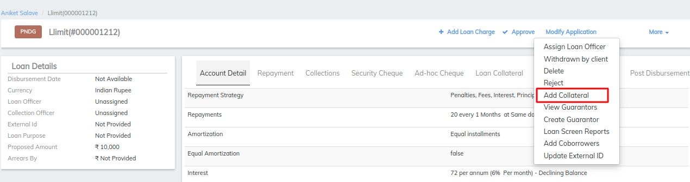
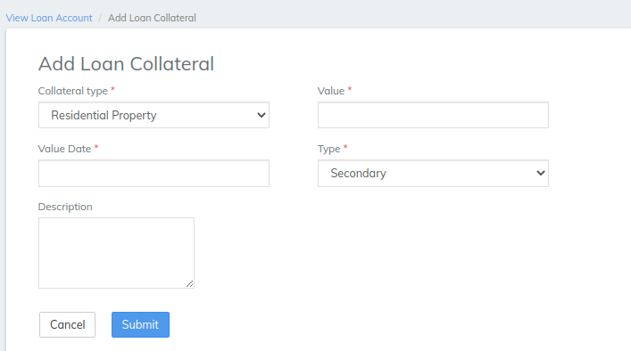
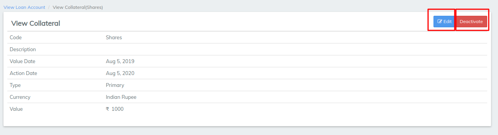
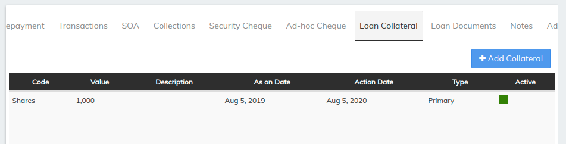

# How to Add Collateral to a Loan Account

## How to Add Collateral to a Loan Account 

One or more collateral items can be added to a loan account application. Collateral can be added to loan accounts in the following ways:&#x20;

* Collateral items can be selected and attached to the loan account application when the loan account application is being created.
* Collateral items can be selected and attached to the loan account application by modifying a loan account application in Pending Approval status.
* Collateral items can be selected and attached when viewing the loan account application by clicking Add Collateral from the More menu on the action bar (the Add Collateral option is available when the status of the loan account application is Pending Approval).

Adding a collateral item to a loan account application does not affect the loan account application's status.

#### To add or modify collateral items to a loan account application when creating or editing a loan account application 

When creating or editing a loan account application, navigate to and complete the **collateral** fields. Click **Submit** when done. See [Loan Account Fields](loan-account-fields.md) Collaterals

#### To add collateral items to a loan account application when viewing a loan account application 

When viewing a loan account, click **More** and select **Add collateral** on the action bar.

1. Type the amount in the **Amount** field.\
   The amount is the value of the collateral item expressed in the same currency as the loan account's currency.&#x20;

&#x20;    2\. Then select Collateral type which can be fixed deposit ,shares and so on&#x20;

&#x20;     3\. Then Select the type for Collateral i,e Primary or secondary

&#x20;    4\. Type a description for the collateral item.

&#x20;     3\. Click **Submit**.

Once the collateral is added it will shows the collateral details as we can see the above image. the same screen allows user to Edit or deactivate the collateral using the buttons Edit and deactivate

\>>Collateral is added and the status as we can see in the above image is active which can be edited as deactivate by simply clicking on the created collateral a window will lead to edit the collateral and deactivate the collateral&#x20;

## &#x20;

