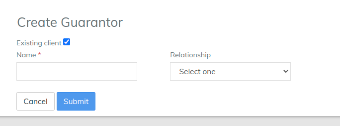
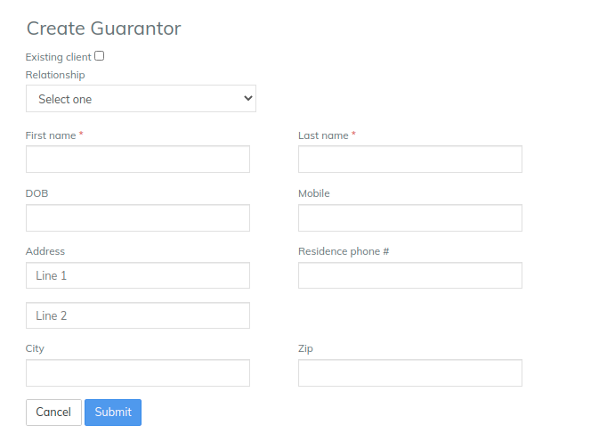
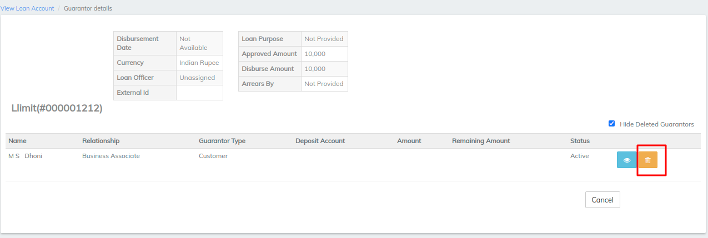

# How to Add/Remove/Modify a Guarantor to a Loan Account

## How to Add/Remove/Modify a Guarantor to a Loan Account 

One or more guarantors can be added to a loan account application when it is Pending Approved or Approved. Guarantors may be but are not required to be clients.

Adding a guarantor to a loan account application does not affect the loan account application's status.

#### To add a guarantor who is an existing client to a loan account application  

When viewing a loan account, click **More** on the action bar and select **Guarantor** .

1. Check the **Existing Client** box.
2. Start typing the client's name in the name field.\
   Candidate client names will appear in a list.
3. Click to select the client in the list who is the guarantor.\
   &#x20;The client details (Name, ID, Office, Activation Date) will display.
4. Select **Relationship** from the list.
5. Click **Submit**.

The guarantor will be added to the loan account application.

#### To add an external guarantor to a loan account application 

When viewing a loan account, click **More** on the action bar and select **Guarantor**.

1. Uncheck the **Existing Client** box.
2. Select **Relationship** from the list.
3. Type the guarantor's **First name** (required).
4. Type the guarantor's **Last name** (required).
5. Select the guarantor's date of birth (**DOB**) from the calendar pop-up.\
   The date format is dd mm yyyy.
6. Type the guarantor's **Address** using one or two lines as necessary.
7. Type the guarantor's **City**.
8. Type the guarantor's **Zip** code.
9. Type the guarantor's **Mobile** phone number.
10. Type the guarantor's **Residence** phone number.&#x20;
11. Click **Submit**.

The guarantor will be added to the loan account application.

#### To remove a guarantor from a loan account. 

When viewing a loan account that has one or more guarantors, click the **Guarantor Details** tab.

1. Click the trashcan next to the guarantor to delete.
2. Click **Confirm**.

The guarantor will be removed from the loan account application.

#### To update guarantor details (external guarantor). 

When viewing a loan account that has one or more guarantors, click the **Guarantor Details** tab.

1. Click the notepad (blue) next to the guarantor to update.
2. Make any desired changes.
3. Click **Submit**.

The guarantor's details will be updated.

## &#x20;

