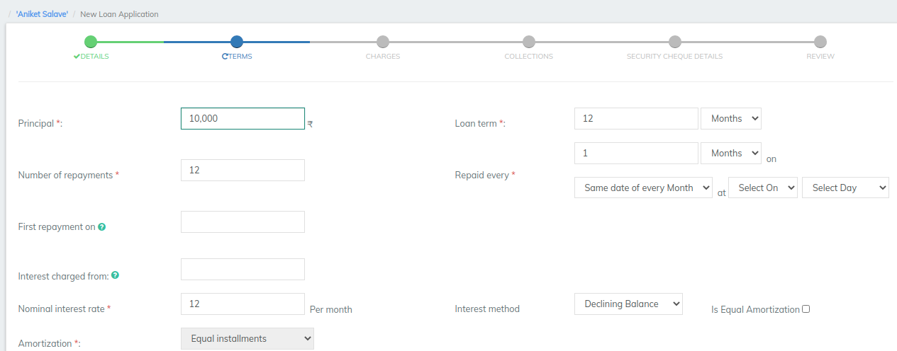
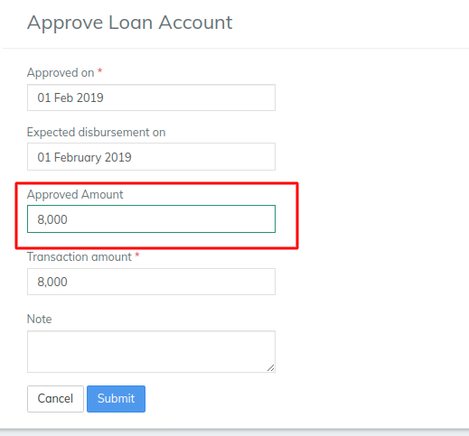

# How to Approve a Loan Account Application

## How to Approve a Loan Account Application 

Once a loan account application whether it is for a client, a group, or a joint liability group has been submitted, it is ready to be approved (the loan account status is Pending Approval and the loan account color is gold).&#x20;

Loans can be approved by LMS users with loan approval permissions.

Approving a loan account application changes the status of the loan from Pending Approval to Approved.

An loan account application that has been approved, but not yet disbursed can be unapproved. Unapproving a loan account application changes the status of the loan from Approved to Pending Approval.&#x20;

#### **To approve a loan account application for a client** 

To approve a loan account application for a client, select **** the client (_needs link to how to find a client)_. Click the **General** tab. The client's loans are listed in the **Loan Account Overview** section.

1. Ensure active loan accounts are displayed by clicking **View Active Loans** on the loan action bar. \
   Pending approval loans will be indicated with a gold color swatch and **Submitted and Pending** **Approval** in the **Status** column.&#x20;
2. Click the loan account to be approved.\
   The loan account form will open.&#x20;
3. Click **Approve** on the action bar.\
   The Approve Loan Account page will open.&#x20;
4. Accept the default date (today), or pick a date in the past from the pop-up calendar for **Approved on**.
5. Capture any notes or comments in the **Note** field.
6. Click **Submit**.

The loan account application will be modified and its status changed to Approved. The loan account is now ready for disbursement.

#### To approve a group loan account application 

To approve a loan account application for a group, select the group (_needs link to how to find a group)_. Click the **General** tab. The group's loans are listed in the **Loan Account Overview** section.

1. Ensure active loan accounts are displayed by clicking **View Active Loans** on the loan action bar. \
   Pending approval loans will be indicated with a gold color swatch and **Submitted and Pending Approval** in the **Status** column.&#x20;
2. Click the loan account to be approved.\
   The loan account form will open.&#x20;
3. Click **Approve** on the action bar.\
   The Approve Loan Account page will open.&#x20;
4. Accept the default date (today), or pick a date in the past from the pop-up calendar for **Approved on**.
5. Capture any notes or comments in the **Note** field.
6. Click **Submit**.

The loan account application will be modified and its status changed to Approved. The loan account is now ready for disbursement.

#### To approve joint liability group (JLG) loan account applications 

To approve JLG loan account applications, select the group (_needs link to how to find a group)._ Click the **Members** tab.

1. Click the member whose loan account application is to be approved.&#x20;
2. Complete the steps for approving a loan account application for a client.&#x20;
3. Repeat for each group member applying for a loan.

The loan account applications will be modified and their status changed to Approved. The loan accounts are now ready for disbursement.

#### To undo loan account application approval 

Locate the loan account to be unapproved by navigating to it through the client or group that holds the loan account.

1. Click the Approved loan that is to be unapproved.
2. Click **Undo Approval** on the action bar.
3. Type a note to explain the reason for undoing the approval.
4. Click **Submit**.

The loan account application approval will be undone and the loan status will be Pending Approval.

#### **Changing Loan amount at the time of Approval:** 

This is for scenarios where the amount applied for and the amount approved for a loan differs.

LMS  now supports the ability to change the proposed loan amount at the time of Loan account approval.&#x20;

In the screen shot below, an example of proposed Loan amount in the New Loan application page is shown.

**Proposed Loan amount: 10,000.** Then submitted and pending for approval

In the screen shot below, an example of changing the Loan amount at the time of Loan Approval is shown.&#x20;

**Loan amount to: 8,000.** Then submitting for approving the loan

## &#x20;

