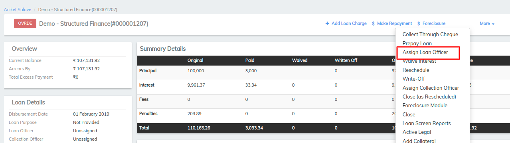

# How to Assign a Loan Officer

## How to Assign a Loan Officer 

A loan officer may be assigned to loan accounts that are Pending Approval, Approved, or Active. A loan officer may be removed from a loan account and a different loan officer assigned when loan accounts are Pending Approval, Approved, or active.

The status of the loan remains the same when a loan officer is assigned.

#### **To assign a Loan Officer to a loan account** 

Locate the loan account to be assigned or reassigned by navigating to it through the client or group that holds the loan account.

1. Select **Assign Loan Officer** from the action bar (it may be located under the **More** menu choice)

1. Select a loan officer from the **To loan officer** list
2. Select the **Assignment date** from the calendar pop-up.
3. Click **Submit.**

## &#x20;

