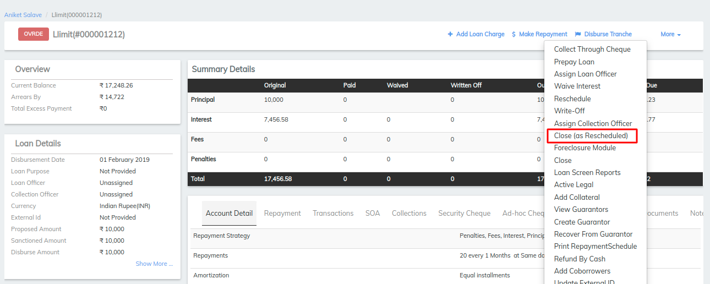
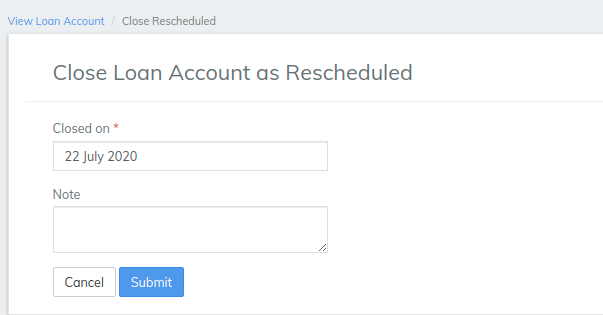

# How to Close a Loan Account as Rescheduled

## How to Close a Loan Account as Rescheduled 

To close a loan account as rescheduled, a LMS user must be granted permission to do so.

_Not sure what this does in the system?_

#### To close a loan account as rescheduled 

To close a client or group loan account, select **** the client or group (_needs link to how to find a client or group)_. Click the **General** tab.

1. Click the loan account to be closed as rescheduled.
2. Click **More**, **Close (as rescheduled)** on the action bar.
3. Accept the date default for **Closed on** or pick a date in the past from the calendar pop-up
4. Optionally, type a descriptive **Note**.
5. Click **Submit**.

The loan account status will be changed to Closed (Rescheduled).

## &#x20;

