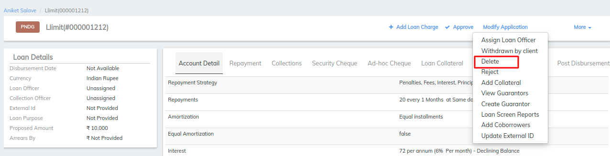

# How to Delete a Loan Account Application

## How to Delete a Loan Account Application

Loan account applications that have a status of Pending Approval may be deleted. When a loan account application is deleted, every record of the loan account is removed from the system.

#### **To delete a loan account application** 

Locate the loan account by navigating to it through the client or group that holds the loan account.

1. Select **Delete** from the action bar (under the **More** menu choice).\
   The loan will be deleted.

