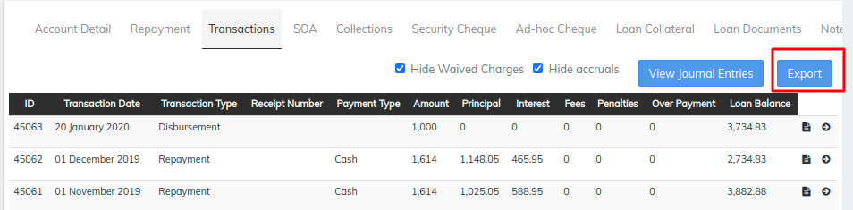
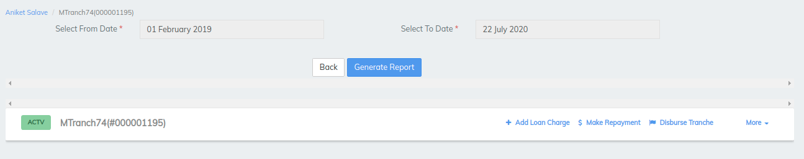
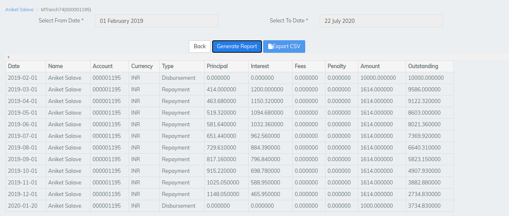

# How to generate - Loan transactions report

## How to generate - Loan transactions report 

Go to Clients>>Click on desired client>>Click on the required loan>>Transactions>>Click on Export button

By default "From date" would be the disbursed date and "To date" would be the expected last repayment date. Click on "Generate Report" button.&#x20;

You could also change the dates for filtering the transactions.&#x20;

It will generate repayment schedule with paid & unpaid transaction details.

## &#x20;

